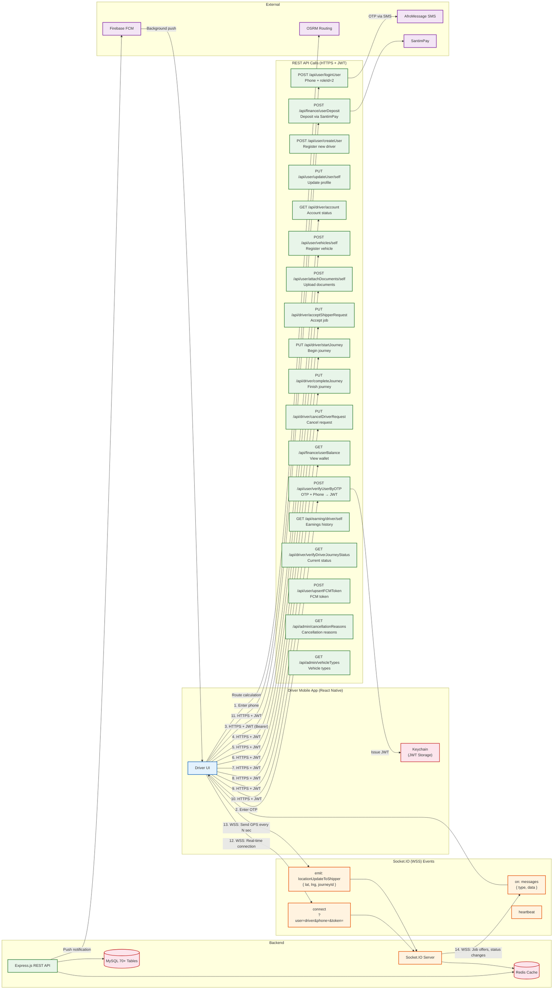
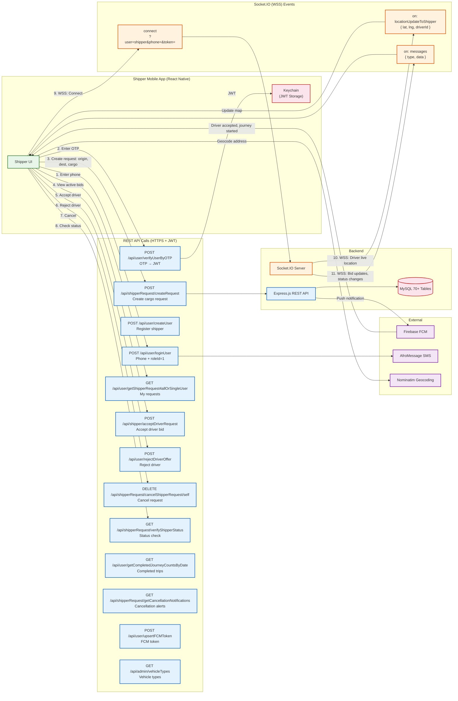
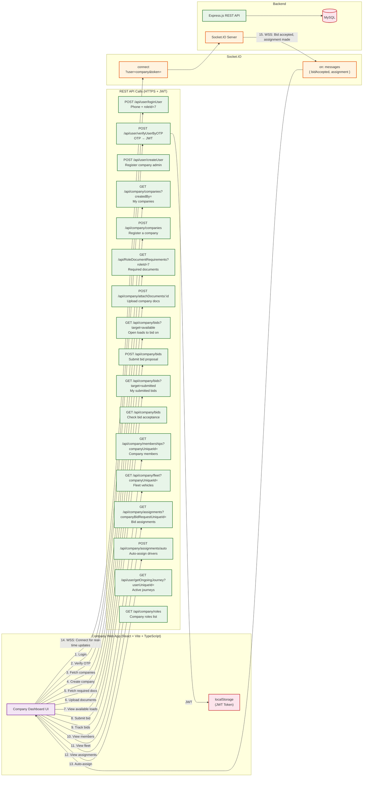
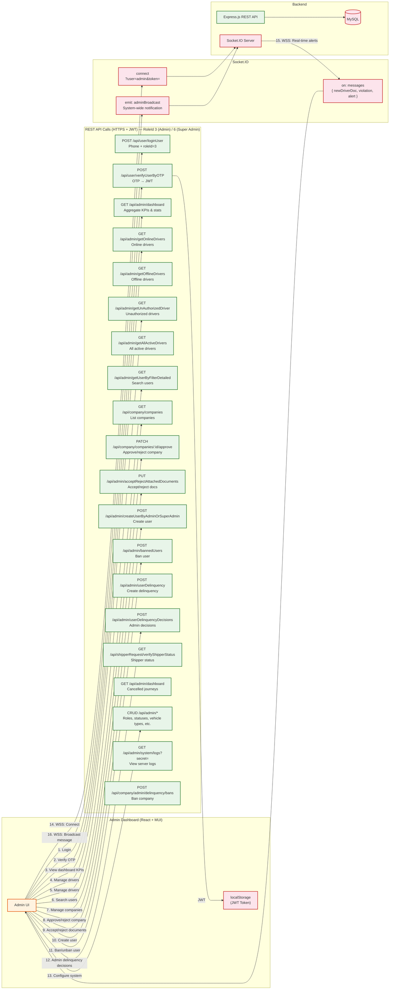

# Mobile Application Security Audit Response

**Submitted to:** Information Network Security Administration (INSA)
**Cyber Security Audit Division**
**Submitted by:** Dynamics Route Technology Solutions
**Date:** [Insert Date]

---

## Section 3: Mobile Application Security Audit Requirements

### 3.1 Business Architecture and Design

#### 1. Business Architecture and Design

**Platform Overview:**

Dynamics Route is a freight/transportation logistics platform connecting shippers, drivers, transport companies, vehicle owners, and administrators through a multi-application ecosystem. The platform operates like Uber Freight, enabling cargo transport matching, real-time journey tracking, payment processing, and compliance management.

**Ecosystem Components:**

| Application | Type | Platform | Technology | Purpose |
|---|---|---|---|---|
| Dynamics Driver | Mobile | Android/iOS | React Native 0.84.0 | Driver job acceptance, GPS tracking, earnings |
| Dynamics Shipper | Mobile | Android/iOS | React Native 0.84.1 | Cargo request creation, driver matching |
| Transport Company | Web | Browser | React 19 + Vite + TypeScript | Company registration, fleet management, bidding |
| Admin Panel | Web | Browser | React 18 + Vite + MUI | System administration, user management, compliance |
| Backend API | Server | Node.js | Express 4.22.1, MySQL 8, Redis | Core business logic, auth, real-time |
| SMS/Email/Push | Service | Cloud | AfroMessage, Nodemailer, FCM | Notifications, OTP delivery |
| Payment Gateway | Service | Cloud | SantimPay | Driver deposits, commission processing |

**Business Flow:**

```
Shipper (Mobile/Web) creates transport request
  → Request broadcasted to drivers and transport companies
  → Drivers bid / Companies bid on batch requests
  → Shipper selects driver/company
  → Driver starts journey with GPS tracking
  → Driver completes journey
  → Payment processed, commission calculated
  → Rating and feedback collected
```

**Deployment:**

- **Production API:** `https://dynamicsroute.tech`
- **Company Web App:** `https://company.dynamicsroute.tech`
- **WebSocket Server:** `wss://transport.digitalmegazen.com`
- **Infrastructure:** VPS (PM2 cluster - 3 instances) + Vercel (serverless)
- **Process Manager:** PM2 with auto-restart, 1GB memory limit
- **Load Balancing:** Nginx reverse proxy (recommended)

---

#### 2. Data Flow Diagram (DFD)

```mermaid
flowchart TD
    classDef mobile fill:#e3f2fd,stroke:#1565c0,stroke-width:2px
    classDef web fill:#f3e5f5,stroke:#7b1fa2,stroke-width:2px
    classDef backend fill:#e8f5e9,stroke:#2e7d32,stroke-width:2px
    classDef external fill:#fff3e0,stroke:#e65100,stroke-width:2px
    classDef storage fill:#fce4ec,stroke:#c62828,stroke-width:2px

    subgraph "Mobile Apps"
        DRIVER["Driver App<br/>(React Native)"]:::mobile
        SHIPPER["Shipper App<br/>(React Native)"]:::mobile
    end

    subgraph "Web Apps"
        COMPANY["Company Web App<br/>(React + Vite)"]:::web
        ADMIN["Admin Dashboard<br/>(React + MUI)"]:::web
    end

    subgraph "Backend Infrastructure"
        API["REST API<br/>Express.js + MySQL"]:::backend
        WS["WebSocket Server<br/>Socket.IO + Redis Adapter"]:::backend
        AUTH["Auth Service<br/>JWT + bcrypt OTP"]:::backend
        PAY["Payment Service<br/>SantimPay Integration"]:::backend
        LOGGER["Logging Service<br/>Winston"]:::backend
    end

    subgraph "Data Storage"
        MYSQL[("MySQL Database<br/>70+ Tables")]:::storage
        REDIS[("Redis Cache<br/>Upstash")]:::storage
        FILES["File Storage<br/>/uploads/"]:::storage
        KEYCHAIN[("Mobile Keychain<br/>(Encrypted)")]:::storage
    end

    subgraph "External Services"
        FCM["Firebase Cloud Messaging"]:::external
        SMS["AfroMessage SMS"]:::external
        EMAIL["SMTP Email<br/>Nodemailer"]:::external
        OSM["OpenStreetMap<br/>Nominatim + OSRM"]:::external
        SANTIMPAY["SantimPay<br/>Payment Gateway"]:::external
        TELEGRAM["Telegram Bot"]:::external
    end

    %% Auth flows
    SHIPPER -- "HTTPS: Phone + OTP" --> AUTH
    DRIVER -- "HTTPS: Phone + OTP" --> AUTH
    COMPANY -- "HTTPS: Phone + OTP" --> AUTH
    ADMIN -- "HTTPS: Phone + OTP" --> AUTH
    AUTH -- "JWT Token (Bearer)" --> SHIPPER
    AUTH -- "JWT Token (Bearer)" --> DRIVER
    AUTH -- "JWT Token (Bearer)" --> COMPANY
    AUTH -- "JWT Token (Bearer)" --> ADMIN
    AUTH -- "bcrypt hash OTP" --> MYSQL
    SHIPPER -- "Store JWT" --> KEYCHAIN
    DRIVER -- "Store JWT" --> KEYCHAIN

    %% API flows
    SHIPPER -- "HTTPS + JWT: CRUD requests" --> API
    DRIVER -- "HTTPS + JWT: Accept/Start/Complete" --> API
    COMPANY -- "HTTPS + JWT: Bids/Fleet/Members" --> API
    ADMIN -- "HTTPS + JWT: Manage all entities" --> API
    API -- "SQL Queries" --> MYSQL
    API -- "Cache/Read" --> REDIS

    %% Real-time flows
    DRIVER -- "WSS: GPS Location Updates" --> WS
    SHIPPER -- "WSS: Receive Driver Location" --> WS
    WS -- "Broadcast" --> REDIS

    %% Notifications
    API -- "Push Notification" --> FCM
    FCM -- "OS Push" --> DRIVER
    FCM -- "OS Push" --> SHIPPER
    API -- "SMS OTP/Alerts" --> SMS
    API -- "Email Verification" --> EMAIL
    API -- "Bot Alerts" --> TELEGRAM

    %% Payments
    DRIVER -- "HTTPS: Deposit Request" --> PAY
    PAY -- "Initiate Payment" --> SANTIMPAY
    SANTIMPAY -- "Webhook Callback" --> PAY

    %% Maps
    DRIVER -- "HTTPS: Route Calculation" --> OSM
    SHIPPER -- "HTTPS: Geocoding" --> OSM
```



---

#### 2a. Actor-Specific Data Flow Diagrams

##### DFD: Driver App — REST API & Socket.IO Flows



##### DFD: Shipper App — REST API & Socket.IO Flows



##### DFD: Company Web App — REST API & Socket.IO Flows



##### DFD: Admin Dashboard — REST API & Socket.IO Flows



---

#### 3. System Architecture Diagram with Database Relations


**Complete Database Schema (MySQL 8, InnoDB, utf8mb4):**

The database schema spans 70+ tables defined in `Database/Database.js` as raw SQL executed at server startup. All tables use InnoDB engine with utf8mb4 charset. UUIDs serve as external identifiers (`userUniqueId`, `vehicleUniqueId`, etc.) while auto-increment integers are internal primary keys. Soft-delete pattern is used across all major entities (`isDeleted`, `deletedAt`, `deletedBy`). Audit trail tables track every change with field-level granularity.

---

##### Domain 1: Users, Authentication & Roles (8 tables)

**`Users`** — Core user registry for all actors (shippers, drivers, admins, companies)
| Column | Type | Constraints | Description |
|---|---|---|---|
| `userId` | INT | PK, AUTO_INCREMENT | Internal identifier |
| `userUniqueId` | VARCHAR(36) | UNIQUE, NOT NULL | UUID (external identifier) |
| `fullName` | VARCHAR(255) | NOT NULL | User's full name |
| `phoneNumber` | VARCHAR(20) | UNIQUE, NOT NULL | Phone (primary login identifier, +251 format) |
| `email` | VARCHAR(255) | UNIQUE, NULLABLE | Email (secondary contact/verification) |
| `isPhoneVerified` | TINYINT(1) | DEFAULT 0 | Phone verification status |
| `isEmailVerified` | TINYINT(1) | DEFAULT 0 | Email verification status |
| `isDeleted` | TINYINT(1) | DEFAULT 0 | Soft-delete flag |
| `deletedAt` | DATETIME | NULLABLE | Soft-delete timestamp |
| `deletedBy` | VARCHAR(36) | FK → Users(userUniqueId) | Who deleted this record |
| `userCreatedAt` | TIMESTAMP | DEFAULT CURRENT_TIMESTAMP | Creation timestamp |
| `userUpdatedAt` | TIMESTAMP | ON UPDATE CURRENT_TIMESTAMP | Last update timestamp |

**`usersCredential`** — Authentication secrets (one-to-one with Users)
| Column | Type | Constraints | Description |
|---|---|---|---|
| `credentialId` | INT | PK, AUTO_INCREMENT | |
| `userUniqueId` | VARCHAR(36) | FK → Users(userUniqueId), UNIQUE | One credential record per user |
| `hashedPassword` | VARCHAR(255) | NULLABLE | bcrypt-hashed password |
| `sharedOTP` | VARCHAR(255) | NULLABLE | bcrypt-hashed generic OTP (for verified users) |
| `phoneVerificationOTP` | VARCHAR(255) | NULLABLE | bcrypt-hashed phone verification OTP |
| `emailVerificationOTP` | VARCHAR(255) | NULLABLE | bcrypt-hashed email verification OTP |
| `emailVerificationToken` | VARCHAR(255) | NULLABLE | UUID token for email verification link |
| `emailVerificationExpiresAt` | DATETIME | NULLABLE | 2-hour expiry for email verification |

**`Roles`** — System role definitions
| Column | Type | Constraints | Description |
|---|---|---|---|
| `roleId` | INT | PK | 1=Shipper, 2=Driver, 3=Admin, 4=VehicleOwner, 5=System, 6=SuperAdmin, 7=CompanyAdmin, 8=Company, 9=Vehicle, 10=Dispatcher |
| `roleName` | VARCHAR(50) | UNIQUE, NOT NULL | Role display name |

**`UserRole`** — Many-to-many user-to-role assignment
| Column | Type | Constraints | Description |
|---|---|---|---|
| `userRoleId` | INT | PK, AUTO_INCREMENT | |
| `userUniqueId` | VARCHAR(36) | FK → Users(userUniqueId) | |
| `roleId` | INT | FK → Roles(roleId) | |
| `userRoleDeletedAt` | DATETIME | NULLABLE | Soft-delete for role assignment |

**`Statuses`** — Status definitions
| Column | Type | Constraints | Description |
|---|---|---|---|
| `statusId` | INT | PK | 1-8 status IDs |
| `statusName` | VARCHAR(100) | UNIQUE, NOT NULL | Active, inactive-vehicle, inactive-documents, banned, etc. |

**`UserRoleStatusCurrent`** — Current role-status mapping
| Column | Type | Constraints | Description |
|---|---|---|---|
| `userRoleStatusId` | INT | PK, AUTO_INCREMENT | |
| `userRoleId` | INT | FK → UserRole(userRoleId) | |
| `statusId` | INT | FK → Statuses(statusId) | Current status |
| `userRoleStatusDescription` | TEXT | NULLABLE | Reason/description |
| `currentVersion` | INT | DEFAULT 1 | Optimistic locking version |

**`UserRoleStatusHistory`** — Append-only audit trail for status changes
| Column | Type | Constraints | Description |
|---|---|---|---|
| `userRoleStatusHistoryId` | INT | PK, AUTO_INCREMENT | |
| `userRoleStatusId` | INT | FK → UserRoleStatusCurrent | |
| `statusId` | INT | FK → Statuses | |
| `userRoleId` | INT | FK → UserRole | |
| `updatedBy` | VARCHAR(36) | FK → Users(userUniqueId) | Who made the change |
| `updatedAt` | TIMESTAMP | DEFAULT CURRENT_TIMESTAMP | |

**`DeviceTokens`** — FCM push notification tokens
| Column | Type | Constraints | Description |
|---|---|---|---|
| `deviceTokenId` | INT | PK, AUTO_INCREMENT | |
| `userUniqueId` | VARCHAR(36) | FK → Users(userUniqueId) | |
| `roleId` | INT | FK → Roles(roleId) | Which role's notifications |
| `token` | VARCHAR(500) | UNIQUE, NOT NULL | FCM registration token |
| `platform` | VARCHAR(10) | NULLABLE | android / ios |
| `revokedAt` | DATETIME | NULLABLE | Token invalidation timestamp |

**Audit Tables:**
- `UsersHistory` — User profile change log (fullName, phoneNumber, email, actionType)
- `UserProfileHistory` — Field-level audit: `fieldName`, `oldValue`, `newValue`, `source` (registration/profile_update/status_change/ban/unban/manual), `changedBy`

---

##### Domain 2: Documents & Compliance (6 tables)

**`DocumentTypes`** — Catalog of required document types
| Column | Type | Constraints | Description |
|---|---|---|---|
| `documentTypeId` | INT | PK, AUTO_INCREMENT | |
| `documentTypeName` | VARCHAR(255) | NOT NULL | e.g., "Driving License", "Business License" |
| `uploadedDocumentName` | VARCHAR(255) | NULLABLE | File naming convention |
| `uploadedDocumentTypeId` | VARCHAR(100) | NULLABLE | Document category |
| `uploadedDocumentDescription` | TEXT | NULLABLE | Description of required document |
| `uploadedDocumentExpirationDate` | DATE | NULLABLE | Whether expiry is tracked |
| `uploadedDocumentFileNumber` | VARCHAR(100) | NULLABLE | Whether file number is tracked |

**`RoleDocumentRequirements`** — Which documents are mandatory per role
| Column | Type | Constraints | Description |
|---|---|---|---|
| `id` | INT | PK, AUTO_INCREMENT | |
| `roleId` | INT | FK → Roles(roleId) | |
| `documentTypeId` | INT | FK → DocumentTypes(documentTypeId) | |
| `isDocumentMandatory` | TINYINT(1) | DEFAULT 0 | Required for activation? |
| `isFileNumberRequired` | TINYINT(1) | DEFAULT 0 | |
| `isExpirationDateRequired` | TINYINT(1) | DEFAULT 0 | |

**`AttachedDocuments`** — Polymorphic document storage (key design pattern)
| Column | Type | Constraints | Description |
|---|---|---|---|
| `attachedDocumentId` | INT | PK, AUTO_INCREMENT | |
| `ownerType` | ENUM('user','company','vehicle') | NOT NULL | Polymorphic owner type |
| `ownerUniqueId` | VARCHAR(36) | NOT NULL | UUID of owner (user/company/vehicle) |
| `documentTypeId` | INT | FK → DocumentTypes(documentTypeId) | |
| `attachedDocumentName` | VARCHAR(500) | NULLABLE | File name on disk |
| `attachedDocumentAcceptance` | ENUM('PENDING','ACCEPTED','REJECTED') | DEFAULT 'PENDING' | Admin review status |
| `documentExpirationDate` | DATE | NULLABLE | |
| `attachedDocumentFileNumber` | VARCHAR(100) | NULLABLE | |
| `documentVersion` | INT | DEFAULT 1 | Version tracking |
| `isDeleted` | TINYINT(1) | DEFAULT 0 | |

**`AttachedDocumentsHistory`** — Versioned audit trail mirroring AttachedDocuments with added `attachedDocumentUpdatedByUserId`, `attachedDocumentDeletedByUserId`, `documentVersion`

**`DocumentTypesHistory`** — Document type change log: `documentTypeId`, `changeType` (UPDATE/DELETE), `changedByUserId`

---

##### Domain 3: Vehicles (5 tables)

**`VehicleTypes`** — Vehicle type catalog
| Column | Type | Constraints | Description |
|---|---|---|---|
| `vehicleTypeId` | INT | PK | |
| `vehicleTypeName` | VARCHAR(100) | NOT NULL | e.g., "Heavy Truck", "Light Truck" |
| `carryingCapacity` | DECIMAL(10,2) | NULLABLE | Weight capacity |
| `cargoType` | ENUM('bulk_only','container_only','both') | DEFAULT 'both' | Cargo compatibility |

**`Vehicle`** — Registered vehicles
| Column | Type | Constraints | Description |
|---|---|---|---|
| `vehicleId` | INT | PK, AUTO_INCREMENT | |
| `vehicleUniqueId` | VARCHAR(36) | UNIQUE, NOT NULL | UUID |
| `vehicleTypeUniqueId` | VARCHAR(36) | FK → VehicleTypes | |
| `licensePlate` | VARCHAR(50) | UNIQUE, NOT NULL | License plate number |
| `color` | VARCHAR(50) | NULLABLE | Vehicle color |
| `isDeleted` | TINYINT(1) | DEFAULT 0 | |

**`VehicleStatusTypes`** — Status type definitions (active, inactive, deleted, suspended, rejected, reserved)
**`VehicleStatus`** — Status assignments with start/end dates
**`VehicleOwnership`** — Ownership tracking: `vehicleUniqueId`, `userUniqueId`, `roleId`, ownership dates
**`VehicleDriver`** — Driver-to-vehicle assignments: `vehicleUniqueId`, `driverUserUniqueId`, `assignmentStatus` (active/inactive)

---

##### Domain 4: Shipping & Journey Core (8 tables)

**`ShipperRequest`** — Cargo transport requests
| Column | Type | Constraints | Description |
|---|---|---|---|
| `shipperRequestId` | INT | PK, AUTO_INCREMENT | |
| `shipperRequestUniqueId` | VARCHAR(36) | UNIQUE, NOT NULL | UUID |
| `userUniqueId` | VARCHAR(36) | FK → Users(userUniqueId) | Requestor (shipper) |
| `vehicleTypeUniqueId` | VARCHAR(36) | FK → VehicleTypes | Required vehicle type |
| `originLat` / `originLng` | DECIMAL(10,7) | NOT NULL | Pickup coordinates |
| `destinationLat` / `destinationLng` | DECIMAL(10,7) | NOT NULL | Dropoff coordinates |
| `originPlace` / `destinationPlace` | VARCHAR(500) | NULLABLE | Human-readable addresses |
| `requestMode` | ENUM('individual_target','company_target') | NOT NULL | Individual driver vs company bidding |
| `targetCompanyUniqueId` | VARCHAR(36) | NULLABLE | For company-targeted requests |
| `journeyStatusId` | INT | FK → JourneyStatus | Current lifecycle status |
| `shippableItemName` / `shippableItemWeight` / `shippableItemQuantity` | Various | NULLABLE | Cargo details |

**`ShipperRequestBatch`** — Batch grouping for company freight requests
| Column | Type | Constraints | Description |
|---|---|---|---|
| `batchUniqueId` | VARCHAR(36) | PK | UUID |
| `shipperUserUniqueId` | VARCHAR(36) | FK → Users | |
| `totalVehicles` | INT | NOT NULL | Number of vehicles needed |
| `origin` / `destination` | VARCHAR(500) | NOT NULL | Route summary |
| `journeyStatusId` | INT | FK → JourneyStatus | |

**`DriverRequest`** — Driver's response/offer to shipper requests
| Column | Type | Constraints | Description |
|---|---|---|---|
| `driverRequestUniqueId` | VARCHAR(36) | PK | UUID |
| `userUniqueId` | VARCHAR(36) | FK → Users(userUniqueId) | Driver |
| `originLat` / `originLng` | DECIMAL(10,7) | NOT NULL | Driver's current location |
| `journeyStatusId` | INT | FK → JourneyStatus | |

**`JourneyStatus`** — 17 lifecycle statuses: waiting, requested, acceptedByDriver, acceptedByShipper, journeyStarted, journeyCompleted, cancelledByShipper, cancelledByDriver, notSelectedInBid, etc.

**`JourneyDecisions`** — Match decisions linking shipper and driver
| Column | Type | Constraints | Description |
|---|---|---|---|
| `journeyDecisionUniqueId` | VARCHAR(36) | PK | UUID |
| `shipperRequestId` | INT | FK → ShipperRequest | |
| `driverRequestId` | INT | FK → DriverRequest | |
| `journeyStatusId` | INT | FK → JourneyStatus | |
| `decisionBy` | ENUM('shipper','driver','admin') | NOT NULL | Who made the decision |

**`Journey`** — Active journey tracking
| Column | Type | Constraints | Description |
|---|---|---|---|
| `journeyId` | INT | PK | |
| `journeyDecisionUniqueId` | VARCHAR(36) | FK → JourneyDecisions | |
| `startTime` | DATETIME | NULLABLE | Journey start timestamp |
| `endTime` | DATETIME | NULLABLE | Journey completion timestamp |
| `fare` | DECIMAL(10,2) | NULLABLE | Agreed fare |

**`JourneyRoutePoints`** — GPS route point tracking
| Column | Type | Constraints | Description |
|---|---|---|---|
| `routePointId` | INT | PK, AUTO_INCREMENT | |
| `journeyDecisionUniqueId` | VARCHAR(36) | FK → JourneyDecisions | |
| `latitude` / `longitude` | DECIMAL(10,7) | NOT NULL | GPS coordinates |
| `timestamp` | TIMESTAMP | DEFAULT CURRENT_TIMESTAMP | |

**`CanceledJourneys`** — Cancellation records with `contextId`, `contextType`, `canceledBy`, `cancellationReasonsTypeId`

**`CancellationReasonsType`** — Predefined cancellation reasons with `roleId` and `requestMode` (individual/company/both) filtering

---

##### Domain 5: Transport Companies (10 tables)

**`TransportCompany`** — Company registration
| Column | Type | Constraints | Description |
|---|---|---|---|
| `companyId` | INT | PK, AUTO_INCREMENT | |
| `companyUniqueId` | VARCHAR(36) | UNIQUE, NOT NULL | UUID |
| `companyName` | VARCHAR(255) | NOT NULL | Legal business name |
| `registrationNumber` | VARCHAR(100) | UNIQUE | Business registration |
| `companyPhone` / `companyEmail` | VARCHAR(100) | NULLABLE | Contact details |
| `companyAddress` | TEXT | NULLABLE | Physical address |
| `approvalStatus` | ENUM('PENDING','ACCEPTED','REJECTED','SUSPENDED') | DEFAULT 'PENDING' | Admin approval workflow |
| `isDeleted` | TINYINT(1) | DEFAULT 0 | |

**`CompanyProfileHistory`** — Field-level audit: mirrors Company with `fieldName`, `oldValue`, `newValue`, `source`

**`CompanyRole`** — Company internal roles: Owner, Manager, Dispatcher, Driver
**`CompanyMembership`** — User-company membership: `companyUniqueId`, `userUniqueId`, `companyRoleId`, `isActive`
**`CompanyVehicle`** — Fleet vehicle assignment: `companyUniqueId`, `vehicleUniqueId`, `assignmentStatus`

**`CompanyBidRequest`** — Company bids on shipper batch requests
| Column | Type | Constraints | Description |
|---|---|---|---|
| `companyBidRequestUniqueId` | VARCHAR(36) | PK | UUID |
| `companyUniqueId` | VARCHAR(36) | FK → TransportCompany | |
| `passengerRequestBatchId` | VARCHAR(36) | FK → ShipperRequestBatch | |
| `numberOfVehiclesOffered` | INT | NOT NULL | |
| `proposedCostPerVehicle` | DECIMAL(10,2) | NOT NULL | Cost breakdown |
| `proposedCostDescription` | TEXT | NULLABLE | Cost details (base, distance, fuel, surge) |
| `bidStatus` | ENUM('SUBMITTED','ACCEPTED','REJECTED','CANCELLED','EXPIRED') | DEFAULT 'SUBMITTED' | |

**`CompanyBidVehicleAssignment`** — Driver/vehicle assignment per accepted bid (detailed lifecycle tracking with driver confirmation PENDING/CONFIRMED/DECLINED)

**`CompanyRating`** — Shipper ratings of companies (1-5 scale)
**`CompanyDelinquency`** / `CompanyDelinquencyResponse` / `AdminDecisionOnDelinquency` — Violation management for companies with graduated ban thresholds (15pts=3d, 30pts=7d, 60pts=90d, 90pts=365d)

---

##### Domain 6: Financial & Payments (15 tables)

| Table | Purpose | Key Columns |
|---|---|---|
| **`PaymentMethod`** | Payment method catalog | cash, bank, telebirr |
| **`PaymentStatus`** | Status definitions | pending, completed, failed |
| **`JourneyPayments`** | Per-journey payment records | journeyDecisionUniqueId, amount, paymentMethodId, paymentStatusId |
| **`TariffRate`** | Pricing configuration | standing rate, journey rate, timing rate |
| **`TariffRateForVehicleTypes`** | Vehicle-specific tariff rates | vehicleTypeUniqueId, rate values |
| **`CommissionRates`** | Commission percentage with effective dates | commissionPercentage, effectiveDate |
| **`CommissionStatus`** | Commission lifecycle | REQUESTED, PENDING, PAID, FREE, CANCELED |
| **`Commission`** | Per-journey commission tracking | journeyDecisionUniqueId, amount, status |
| **`SubscriptionPlan`** | Driver subscription plan definitions | planName, description |
| **`SubscriptionPlanPricing`** | Plan pricing with effective dates | planId, price, effectiveDate |
| **`UserSubscription`** | Driver subscription assignments | userUniqueId, planId, startDate, endDate, status |
| **`DepositSource`** | Deposit source types | driver, bonus, admin, transfer |
| **`FinancialInstitutionAccounts`** | Bank/mobile money accounts | institutionName, accountNumber, accountHolder |
| **`UserDeposit`** | Driver deposits (SantimPay integration) | depositURL, depositStatus, santimPayTransactionId, amount |
| **`UserBalance`** | Running balance ledger | balanceType (Deposit, Commission, Transfer, Refund, Subscription, freeGift), amount |
| **`UserBalanceTransfer`** | Balance transfers between drivers | fromUser, toUser, amount |
| **`UserRefund`** | Refund processing | depositId, amount, reason |

---

##### Domain 7: Delinquency & Bans (7 tables)

| Table | Purpose | Key Columns |
|---|---|---|
| **`DelinquencyTypes`** | Violation definitions | severity (LOW/MEDIUM/HIGH/CRITICAL), points |
| **`UserDelinquency`** | Accusations against users | severity, responseDeadline, status |
| **`UserDelinquencyResponse`** | User's formal defense | responseText, submittedAt |
| **`AdminDecisionOnUserDelinquency`** | Admin ruling | decision (EXONERATED/UPHELD/REDUCED/DISMISSED) |
| **`BannedUsers`** | Active bans | duration, expiryDate, reason |
| **`BannedUserDelinquency`** | Ban-delinquency junction | banId, delinquencyId |
| **`CompanyBan`** | Company suspensions | same pattern with graduated thresholds |

---

##### Key Relationship Diagram

```
Users (1) ──── (0..N) UserRole ──── (1) Roles
Users (1) ──── (1) usersCredential
Users (1) ──── (0..N) DeviceTokens
Users (1) ──── (1..N) UserRoleStatusCurrent ──── (1) Statuses
Users (1) ──── (0..N) ShipperRequest ──── (0..1) VehicleTypes
Users (1) ──── (0..N) DriverRequest
Users (1) ──── (0..N) VehicleOwnership ──── (1) Vehicle ──── (1) VehicleTypes
Vehicle ──── (0..N) VehicleDriver ──── (1) Users (driver)
ShipperRequest (1) ──── (0..N) JourneyDecisions ──── (0..1) DriverRequest
JourneyDecisions (1) ──── (0..1) Journey ──── (0..N) JourneyRoutePoints
JourneyDecisions (1) ──── (0..1) CanceledJourneys ──── (1) CancellationReasonsType
ShipperRequest (0..N) ──── ShipperRequestBatch ──── (0..N) CompanyBidRequest ──── (1) TransportCompany
CompanyBidRequest (1) ──── (0..N) CompanyBidVehicleAssignment ──── (0..1) Vehicle/DriverRequest
TransportCompany (1) ──── (0..N) CompanyMembership ──── (1) Users
TransportCompany (1) ──── (0..N) CompanyVehicle ──── (1) Vehicle
TransportCompany (1) ──── (0..N) CompanyRating
Users (1) ──── (0..N) UserDeposit → SantimPay
Users (1) ──── (0..N) UserBalance
Users (1) ──── (0..N) UserSubscription ──── (1) SubscriptionPlan
Users (1) ──── (0..N) UserDelinquency ──── (0..1) AdminDecisionOnUserDelinquency
TransportCompany (1) ──── (0..N) CompanyDelinquency ──── (0..1) AdminDecisionOnDelinquency
AttachedDocuments ── polymorphic FK → Users(userUniqueId) OR TransportCompany(companyUniqueId) OR Vehicle(vehicleUniqueId)  (via ownerType + ownerUniqueId)
```

##### Design Patterns

| Pattern | Implementation | Tables |
|---|---|---|
| **UUID External IDs** | VARCHAR(36) UUIDs exposed via API; INT PKs internal only | All major entities |
| **Soft Delete** | `isDeleted`, `deletedAt`, `deletedBy` columns | Users, Vehicle, TransportCompany, AttachedDocuments, etc. |
| **Audit Trail** | Append-only history tables mirroring parent with change metadata | UserProfileHistory, CompanyProfileHistory, AttachedDocumentsHistory, DocumentTypesHistory, UserRoleStatusHistory |
| **Polymorphic Ownership** | `ownerType` ENUM + `ownerUniqueId` pattern | AttachedDocuments (user/company/vehicle) |
| **Optimistic Locking** | `currentVersion` column | UserRoleStatusCurrent |
| **Role-Based Document Requirements** | RoleDocumentRequirements table links roles to required document types | Document system |
| **Graduated Ban System** | Point-based thresholds with escalating suspension durations | Delinquency + Ban tables |
| **State Machine** | JourneyStatus drives complex lifecycle with 17 defined statuses | Journey, ShipperRequest, DriverRequest |

---

#### 4. Native Applications

- **Driver App (Dynamics Driver):**
  - Package: `com.driverloadnow`
  - Android: minSdk 24, targetSdk 36, compileSdk 36
  - iOS: Deployment target (configured via Podfile)
  - Version: 1.1.7 (versionCode 17)
  - ProGuard enabled, Hermes engine enabled
  - React Native 0.84.0 (New Architecture / Bridgeless mode)

- **Shipper App (Dynamics Shipper):**
  - Package: `com.shipperloadnow`
  - Android: SDK 35 (Android 15, 16KB page alignment)
  - iOS: 14.0+ deployment target
  - Version: 1.5.6
  - React Native 0.84.1

---

#### 5. Hybrid Applications

Both mobile apps are **React Native** hybrid applications:

- **Framework:** React Native 0.84.x
- **UI Libraries:** react-native-paper (Material Design), react-native-elements
- **Navigation:** @react-navigation/drawer (Driver), @react-navigation/stack + Redux-driven (Shipper)
- **State Management:** Redux Toolkit (both apps)
- **Real-time:** Socket.IO Client
- **Maps:** react-native-maps + OpenStreetMap/Nominatim + OSRM
- **Web Views:** Not used for core functionality
- **Native Modules:** react-native-keychain, react-native-geolocation-service, react-native-maps, Firebase SDKs
- **Hermes Engine:** Enabled on Android (improved performance, reduced memory)

---

#### 6. Progressive Web Apps (PWA)

Not applicable. The platform uses native mobile applications (Android/iOS) and separate web applications (React + Vite) for company and admin interfaces. No PWA implementation exists.

---

#### 7. Threat Model Mapping

| Attack Vector | OWASP Category | Threat Level | Security Controls |
|---|---|---|---|
| **Insecure Local Data Storage** | M1 | High | JWT tokens stored in hardware-backed Keychain/Keystore (react-native-keychain). AsyncStorage used for non-sensitive cache only. |
| **Insecure Communication** | M3 | High | All API calls over HTTPS/TLS. WebSocket over WSS. Helmet security headers. Logger sanitizes sensitive fields (password, token, secret, creditCard). |
| **Insecure Authentication** | M4 | Critical | OTP-based authentication with bcrypt hashing. JWT Bearer token. Rate limiting on login (10 req/15min per IP+phone). Role-based access control. |
| **Broken Cryptography** | M5 | Medium | bcryptjs for password/OTP hashing. JWT signed with HMAC-SHA256. ES256 JWT for SantimPay payments. TLS 1.2/1.3 for all transmissions. |
| **Client-Side Injection** | M7 | Medium | Parameterized SQL queries (mysql2). Joi input validation on all endpoints. File upload MIME type validation. Helmet XSS protection. |
| **Improper Platform Usage** | M8 | Low | Official SDKs used (Firebase, react-native-keychain, etc.). No jailbreak/root detection currently implemented. |
| **Reverse Engineering** | M9 | Medium | ProGuard enabled on Android. No code obfuscation on JS bundle currently. Debug keystore present in Android project. |
| **Extraneous Functionality** | M10 | Medium | Dev endpoints exposed: `getUserOtp`, `seedTestDocument`, system logs viewer with secret key. Should be disabled in production. |
| **Tampered Build Files** | M2 | Medium | Android APK signed with release keystore. No integrity checks on client side. |
| **Session Management** | - | High | JWT tokens currently have **no expiration** (no `expiresIn` set). No refresh token mechanism. Tokens are permanent until password/secret change. |
| **MITM via WebSocket** | M3 | High | `rejectUnauthorized: false` set in Socket.IO config on mobile apps — disables TLS certificate validation. JWT token passed in WebSocket URL query parameter. |
| **OTP Interception** | M4 | High | OTP sent via Telegram bot (documented risk) and SMS. Math.random() used for OTP generation (not crypto-safe). |

---

#### 8. System Functionality

| Feature | Description | Security-Critical? | Data Sensitivity |
|---|---|---|---|
| **User Registration** | Phone/email + OTP verification, role selection | Yes | PII (phone, name, email) |
| **Login/Authentication** | OTP-based login, JWT issuance | Yes | Credentials, JWT tokens |
| **Profile Management** | Update name, phone, email, documents | Yes | PII |
| **Shipper Request Creation** | Create cargo transport requests with origin/destination | Yes | Location data, cargo details |
| **Driver Job Acceptance** | Accept/decline shipper requests, bid on jobs | Yes | Location, earnings data |
| **Real-Time GPS Tracking** | Live location sharing via WebSocket | Yes | Real-time GPS coordinates |
| **Journey Management** | Start, track, complete journeys | Yes | Route data, timestamps |
| **Payment Processing** | Driver deposits via SantimPay, commission calculation | Yes | Financial data |
| **Subscription Management** | Driver subscription plans | Yes | Payment data |
| **Document Upload** | Upload license, insurance, certificates | Yes | PII, document images |
| **Company Management** | Register companies, manage fleet and members | Yes | Business data |
| **Company Bidding** | Companies bid on batch shipper requests | Yes | Financial proposals |
| **Admin Dashboard** | System-wide management, user bans, compliance | Yes | All system data |
| **Delinquency System** | Violation tracking, bans, dispute resolution | Yes | Behavioral data |
| **Notifications** | Push (FCM), SMS (AfroMessage), Email (SMTP) | Yes | Device tokens, phone, email |
| **Ratings & Feedback** | Rate drivers, companies | No | Non-sensitive |
| **Force Update** | Version check, force update mechanism | No | Non-sensitive |
| **File Storage** | Upload and serve documents | Yes | Document content |

---

#### 9. Role / System Actor Relationship

| Actor | Role ID | Description | Permissions | Restrictions |
|---|---|---|---|---|
| **Shipper** | 1 | Cargo sender | Create/cancel own requests, accept driver bids, track journeys, rate drivers | Cannot view other shipper data, no admin access |
| **Driver** | 2 | Transport provider | Accept/decline jobs, start/complete journeys, manage vehicle, view earnings | Cannot create shipper requests, no admin access |
| **Admin** | 3 | System administrator | Manage users, approve documents, handle disputes, view all data | Restricted from direct financial operations |
| **Vehicle Owner** | 4 | Vehicle lessor | Register vehicles, assign to drivers | Cannot access shipping/finance data |
| **System** | 5 | Automated system | Background tasks, timeout detection, automated notifications | No user-facing access |
| **Super Admin** | 6 | Full system access | All permissions including user creation, system config, all CRUD operations | Internal only |
| **CompanyAdmin** | 7 | Transport company manager | Manage company, fleet, members, submit bids, view assignments | Cannot access other companies |
| **Company (Entity)** | 8 | Entity role for document compliance | Document attachment for company entity | No login capability |
| **Vehicle (Entity)** | 9 | Entity role for document compliance | Document attachment for vehicle entity | No login capability |
| **Dispatcher** | 10 | Fleet dispatcher | Assign drivers to bids, manage fleet assignments | Cannot manage company profile or finances |

**Company Internal Roles:**

| Company Role | Description |
|---|---|
| Owner | Full company access, manage members, bids, fleet |
| Manager | Manage members, fleet, submit bids |
| Dispatcher | Manage assignments and bids only |
| Driver | Associated driver member, can be assigned to jobs |

**User Statuses:**

| Status | Description |
|---|---|
| Active | Fully verified and active |
| Inactive - vehicle not registered | Driver hasn't registered a vehicle |
| Inactive - documents missing | Missing mandatory documents |
| Inactive - documents rejected | Documents rejected by admin |
| Inactive - documents pending | Documents under review |
| Inactive - banned by admin | Admin-issued ban |
| Inactive - no subscription | Driver without active subscription |
| Inactive - account deleted | Soft-deleted account |

---

#### 10. Test Account

| Account Type | Phone Number | OTP | Role ID | Notes |
|---|---|---|---|---|
| **Admin** | [Provided separately] | [Provided separately] | 3/6 | Full admin access |
| **Driver** | [Provided separately] | [Provided separately] | 2 | Active with vehicle registered |
| **Shipper** | [Provided separately] | [Provided separately] | 1 | Can create requests |

> **Note:** Test credentials will be provided directly to INSA auditors upon commencement of testing. They are not included in this document for security purposes.

---

#### 11. Source Code & Build Files

| Component | Binary/Artifact | Source Code |
|---|---|---|
| **Backend API** | Deployed on VPS + Vercel | Full source available at `transportBackEndNative/` |
| **Driver App (Android)** | `app-release.apk` / `.aab` | Available at `DriverLoadNow/` |
| **Driver App (iOS)** | `.ipa` | Available at `DriverLoadNow/ios/` |
| **Shipper App (Android)** | `app-release.apk` / `.aab` | Available at `shipperLoadNow/` |
| **Shipper App (iOS)** | `.ipa` (under development) | Available at `shipperLoadNow/ios/` |
| **Company Web App** | Vite build (`dist/`) | Available at `transportCompany/` |
| **Admin Panel** | Vite build (`dist/`) | Available at `transportAdmin/` |

**Build Details (Driver App):**
- applicationId: `com.driverloadnow`
- minSdk: 24, targetSdk: 36, compileSdk: 36
- versionCode: 17, versionName: "1.1.7"
- ProGuard: enabled in release builds
- Hermes: enabled

**Build Details (Shipper App):**
- applicationId: `com.shipperloadnow`
- minSdk: 24, targetSdk: 35, compileSdk: 35
- versionName: "1.5.6"
- ProGuard: enabled
- Hermes: enabled

---

#### 12. API Documentation & Access

**Base URLs:**
- Production API: `https://dynamicsroute.tech`
- Company API: `https://company.dynamicsroute.tech`
- WebSocket: `wss://transport.digitalmegazen.com`
- Swagger UI: `https://dynamicsroute.tech/api-docs`

**API Documentation:**
- Swagger/OpenAPI spec: `api-docs.json`
- Postman Collection: `TransportHttp-RESTAPI.postman_collection.json`
- Company API docs: `frontend_company_api_docs.md`

**Authentication:**
- All API endpoints (except auth) require `Authorization: Bearer <JWT>`
- Auth endpoints: `/api/user/loginUser`, `/api/user/createUser`, `/api/user/verifyUserByOTP`
- Admin endpoints require roleId 3 (Admin) or 6 (Super Admin)
- WebSocket authentication via query params: `token=Bearer%20<JWT>`

**Key API Endpoint Categories:**

| Category | Base Path | Count |
|---|---|---|
| User/Auth | `/api/user/` | ~15 endpoints |
| Admin | `/api/admin/` | ~25 endpoints |
| Driver | `/api/driver/` | ~15 endpoints |
| Shipper | `/api/shipper/`, `/api/shipperRequest/` | ~12 endpoints |
| Company | `/api/company/` | ~30 endpoints |
| Finance | `/api/finance/` | ~20 endpoints |
| Documents | `/api/user/attachDocuments/`, `/api/company/attachDocuments/` | ~10 endpoints |
| Vehicle | `/api/vehicle/`, `/api/user/vehicles/` | ~8 endpoints |
| Journey | `/api/journey/`, `/api/journeyDecisions/` | ~8 endpoints |
| Reference | `/api/admin/vehicleTypes`, `/api/admin/roles`, `/api/admin/statuses` | ~10 endpoints |

**Test API Keys:**
- API Key (X-API-Key): [Provided upon request]
- Firebase Service Account: Provided in `FCM_SERVICE_ACCOUNT_JSON`
- SantimPay Merchant ID: Configured in environment

---

#### 13. Third-Party Services & SDKs

| Service/SDK | Version | Purpose | Data Shared | Security Measures |
|---|---|---|---|---|
| **Firebase Admin SDK** | 13.7.0 (Backend) | Push notifications | FCM tokens, target user IDs | Service account with restricted permissions |
| **@react-native-firebase/app** | 23.4.x (Mobile) | Firebase core | Device info, app instance ID | Google Play Services integrity |
| **@react-native-firebase/messaging** | 23.4.x (Mobile) | Push notifications | FCM tokens | Google-managed secure channel |
| **@react-native-firebase/crashlytics** | 23.4.x (Mobile) | Crash reporting | Stack traces, device info | Crash data only (no PII by design) |
| **@react-native-firebase/auth** | 23.4.x (Mobile) | Phone auth (configured but unused) | Phone number | Firebase-managed |
| **Socket.IO** | 4.8.1 | Real-time communication | GPS coordinates, JWT token | WSS transport, Redis adapter for scaling |
| **react-native-keychain** | 10.0.0 (Driver) / 8.2.0 (Shipper) | Secure token storage | JWT tokens | Hardware-backed Android Keystore / iOS Keychain |
| **react-native-maps** | 1.14.0 / 1.26.20 | Map display | GPS coordinates | Device-side rendering |
| **react-native-geolocation-service** | 5.3.1 | GPS location | GPS coordinates | Runtime permission controls |
| **react-native-permissions** | 5.4.0 / 4.1.5 | Runtime permissions | None | OS-level permission prompts |
| **Axios** | 1.9.0+ | HTTP client | All API data | HTTPS, Bearer token auth, retry logic |
| **Nodemailer** | 8.0.4 | Email delivery | Email addresses, names | SMTP with auth |
| **AfroMessage** | API | SMS delivery | Phone numbers | HTTPS API with token |
| **SantimPay** | API | Payment gateway | Payment amount, merchant ID | ES256 JWT signed requests, webhook signature verification |
| **OpenStreetMap (Nominatim)** | Self-hosted | Geocoding | GPS coordinates | HTTP (no TLS on self-hosted instance) |
| **OSRM** | router.project-osrm.org | Route calculation | Origin/destination coordinates | HTTPS |
| **Redis (Upstash)** | ioredis 5.6.1 | Caching, pub/sub | Non-sensitive cached data | TLS enabled |
| **react-native-google-signin** | 16.0.0 (Driver) | Google OAuth (configured, unused in UI) | None currently | Web client ID configured |
| **Notifee** | 9.1.8 (Shipper) | Local notifications | None | OS notification channels |
| **react-native-sms-retriever** | 1.1.1 (Shipper) | Auto-read OTP from SMS | SMS content (device-side) | Android SMS Retriever API |
| **i18next** | 25.x | Internationalization | Language preference | None (local only) |
| **MUI (Material UI)** | 6.x (Admin) | UI components | None | N/A |
| **Leaflet** | 1.9.4 (Company) | Map display | GPS coordinates | Device-side rendering |

---

#### 14. Authentication & Authorization Details

**Authentication Mechanisms:**

1. **Primary: Phone/Email + OTP**
   - User enters phone number (+251) or email
   - Server generates 6-digit OTP (Math.random, not crypto-safe)
   - OTP sent via SMS (AfroMessage) and/or Telegram bot
   - OTP verified against bcrypt-hashed value in database
   - On success: JWT token issued, stored in mobile Keychain

2. **JWT Bearer Token**
   - Format: `Authorization: Bearer <token>`
   - Payload: `{ data: { userUniqueId, phoneNumber, roleId } }`
   - Algorithm: HMAC-SHA256
   - Secret: Configured via `SECRET_KEY` env var
   - **No expiration** set (tokens are permanent until secret change)

3. **Password-based Auth (Web Apps)**
   - Company Web App: Uses same OTP flow
   - Admin Panel: JWT with admin role validation
   - All passwords bcrypt-hashed

4. **Social Login (Configured, Not Active)**
   - Google Sign-In configured in Driver app (commented out in UI)
   - OAuth client IDs present in codebase

**Session Management:**

- Tokens stored in `react-native-keychain` (hardware-backed encryption)
- AsyncStorage fallback (migrated to Keychain on access)
- No refresh token mechanism
- Auto-logout on: token verification failure, "jwt malformed", "token expired", account deleted
- Logout clears: SecureStorage + AsyncStorage + Redux state + FCM token + app restart

**Authorization Model:**

- **Backend:** Middleware-based RBAC with 5 levels:
  1. `verifyTokenOfAxios` - Valid JWT + user exists + not deleted
  2. `verifyIfUserIsSupperAdmin` - roleId === 6
  3. `verifyIfUserIsAdminOrSupperAdmin` - roleId === 3 or 6
  4. `verifyIfUserIsAdminSuperAdminOrCompanyAdmin` - roleId === 3, 6, or 7
  5. `verifyIfOperationIsAllowedByUserDriver` - Self-data access only

- **Mobile Apps:** Redux-driven screen visibility based on auth state and driver account status

---

#### 15. Compliance & Regulatory Requirements

| Requirement | Status | Notes |
|---|---|---|
| **Ethiopian Data Protection** | Partial | User consent obtained during registration. Privacy Policy displayed. Amharic language support. |
| **PCI DSS** | N/A | Payment processing handled by SantimPay (third-party gateway). Platform does not store credit card data. |
| **GDPR** | Partial | User data deletion available via admin. Soft-delete pattern used. Audit logs maintained. |
| **Ethiopian Telecom Regulations** | Compliant | Phone-based OTP auth, SMS integration via local provider (AfroMessage). |
| **OWASP Mobile Top 10** | Partially addressed | See Threat Model Mapping (Section 3.1.7) for gaps. |
| **ISO/IEC 27001** | Not certified | Security controls follow principles but no formal certification. |
| **Internal Security Policies** | Present | Logger sanitization, parameterized queries, input validation, rate limiting. |

---

#### 16. Secure Communication Details

**Transport Security:**

| Channel | Protocol | TLS Version | Certificate Validation |
|---|---|---|---|
| REST API | HTTPS (TLS) | TLS 1.2/1.3 | Server-side (OS-level) |
| WebSocket | WSS | TLS 1.2/1.3 | **`rejectUnauthorized: false`** (mobile apps — RISK) |
| SMS API | HTTPS | TLS 1.2 | Server-validated |
| Email (SMTP) | SMTP with STARTTLS | TLS 1.2 | Server-validated |
| Firebase FCM | Google-managed | TLS 1.3 | Google CA |
| SantimPay API | HTTPS | TLS 1.2/1.3 | ES256 JWT signature verification |
| Redis (Upstash) | TLS | TLS 1.2 | TLS enabled in config |
| Nominatim (Self-hosted) | **HTTP** | **None** | **RISK: Unencrypted geocoding requests** |

**Data at Rest:**

| Storage | Encryption | Location |
|---|---|---|
| MySQL Database | No encryption at rest (innoDB tables) | Server disk |
| Redis Cache | In-memory, TLS in transit | Upstash cloud |
| JWT Tokens (Mobile) | Hardware-backed (Keychain/Keystore) | Device |
| AsyncStorage (Mobile) | **No encryption** | Device (non-sensitive only) |
| File Uploads | No encryption at rest | Server `/uploads/` directory |
| Passwords/OTPs | bcrypt hashed | Database |
| User PII (phone, email) | Plaintext in DB | Database |
| Environment Secrets | Plaintext in .env | Server file system |

**Key Management:**
- JWT Secret: Environment variable `SECRET_KEY`
- API Key: Environment variable `API_KEY`
- Firebase Service Account: Environment variable `FCM_SERVICE_ACCOUNT_JSON`
- SantimPay Private Key: Environment variable `SANTIMPAY_PRIVATE_KEY` (ES256)
- SMS Token: Environment variable `SMS_TOKEN`
- Redis URL: Environment variable `UPSTASH_REDIS_URL`
- All keys stored in `.env` file, loaded at startup via `dotenv`

**Certificate Pinning:**
- Not implemented on mobile apps (SSL certificate validation not enforced for WebSocket — `rejectUnauthorized: false`)

---

#### 17. Logging & Monitoring Setup

**Server-Side Logging (Winston):**

| Log File | Content | Retention |
|---|---|---|
| `logs/error.log` | Error-level logs | 5MB x 10 rotated files |
| `logs/combined.log` | All log levels | 5MB x 10 rotated files |
| `logs/audit.log` | Business events (structured JSON) | 5MB x 10 rotated files |
| `logs/exceptions.log` | Uncaught exceptions | 5MB x 5 rotated files |
| `logs/rejections.log` | Unhandled rejections | 5MB x 5 rotated files |

**Application Logger Events:**
- `apiRequest()` - HTTP method, URL, status, response time, IP, user agent
- `apiError()` - Stack traces, request context, sanitized body
- `databaseQuery()` - SQL queries (development only)
- `databaseError()` - Query and params on error
- `userLogin()` - Login attempts (success/failure)
- `securityEvent()` - Security-relevant events
- `paymentProcessed()` - Payment events
- `commissionCreated()` - Commission calculations

**Logger Sanitization:**
Sensitive fields automatically redacted from logs: `password`, `token`, `secret`, `creditCard`, `ssn`, `cvv`

**Mobile App Monitoring:**

| Tool | Purpose |
|---|---|
| Firebase Crashlytics | Crash reporting (production only, disabled in dev) |
| Custom ErrorBoundary (Shipper) | Graceful error handling, crash prevention |
| Global Error Handler (Driver) | Catches ReferenceError, TypeError, SyntaxError, RangeError |
| react-native-exception-handler (Driver) | Native crash handling with restart capability |
| Console.log stripping (Shipper) | babel-plugin-transform-remove-console in production |

**Performance Monitoring:**
- Slow query detection (>100ms threshold)
- PM2 auto-restart on crash
- Health check endpoint: `GET /` returns `{ message: "Server is running" }`
- Database pool metrics via `getPoolMetrics()`

**Alerting:**
- PM2 auto-restart with email/notification on crash
- Telegram bot for operational alerts (configured)
- Graceful shutdown on SIGTERM/SIGINT (10s forced exit timeout)

---

## Section 4: Purpose and Functionality of the Mobile Application

### 4.1 OS Supported by the Mobile Application

| App | Android | iOS | Minimum Version | Target Version |
|---|---|---|---|---|
| **Dynamics Driver** | Yes | Yes (configured) | Android 7.0 (API 24), iOS 14.0+ | Android 15 (API 36) |
| **Dynamics Shipper** | Yes | Yes (under development) | Android 7.0 (API 24), iOS 14.0+ | Android 15 (API 35) |
| **Transport Company (Web)** | Browser-based | Browser-based | N/A (PWA not supported) | N/A |
| **Admin Panel (Web)** | Browser-based | Browser-based | N/A | N/A |

### 4.2 Source Code or Binary (APK/IPA)

- **Driver App (.apk/.aab):** Available for Android. Compiled with ProGuard + Hermes. Version 1.1.7.
- **Shipper App (.apk/.aab):** Available for Android. Compiled with ProGuard + Hermes. Version 1.5.6.
- **iOS (.ipa):** Available upon request for both apps (iOS builds configured but primarily Android-focused).
- **Source Code:** Available for all components upon authorized request.

### 4.3 Specific Functionalities or Components for Detailed Testing

| Priority | Component | Rationale |
|---|---|---|
| **HIGH** | **Authentication Flow** | OTP generation (Math.random), JWT no expiration, Telegram OTP delivery |
| **HIGH** | **Payment Integration** | SantimPay webhook, deposit flow, balance management |
| **HIGH** | **Real-Time GPS Tracking** | WebSocket with TLS bypass (`rejectUnauthorized: false`), location data accuracy |
| **HIGH** | **API Security** | JWT token lifetime, RBAC enforcement, SQL injection testing |
| **HIGH** | **File Upload** | Document upload, path traversal, file type validation bypass |
| **MEDIUM** | **Driver-Shipper Matching** | Bid/accept/reject logic, timeout handling |
| **MEDIUM** | **Company Bidding System** | Bid lifecycle, assignment mechanism, commission calculation |
| **MEDIUM** | **Delinquency & Ban System** | Violation tracking, dispute resolution, ban enforcement |
| **MEDIUM** | **Admin Dashboard** | User management, document approval, dashboard data exposure |
| **LOW** | **Profile Management** | Update user data, document upload |
| **LOW** | **Ratings & Feedback** | Rating manipulation, input validation |

### 4.4 Compliance or Security Requirements

See Section 3.1.15 (Compliance & Regulatory Requirements) above.

### 4.5 Authentication Mechanisms Used

See Section 3.1.14 (Authentication & Authorization Details) above.

### 4.6 Sensitive Data Stored or Transmitted

| Data Type | Category | Stored Where | In Transit | At Rest Protection |
|---|---|---|---|---|
| **Phone Number** | PII | MySQL (`Users`), AsyncStorage (cache) | HTTPS/TLS | Plaintext in DB |
| **Full Name** | PII | MySQL (`Users`), AsyncStorage (cache) | HTTPS/TLS | Plaintext in DB |
| **Email Address** | PII | MySQL (`Users`) | HTTPS/TLS, SMTP TLS | Plaintext in DB |
| **GPS Coordinates** | Location | MySQL (`JourneyRoutePoints`), Redis (transient), WebSocket | WSS | Plaintext in DB |
| **JWT Tokens** | Auth | Mobile Keychain (encrypted), AsyncStorage (fallback) | HTTPS/TLS, WSS | Hardware-backed encryption (mobile) |
| **Passwords/OTPs** | Auth | MySQL (`usersCredential`) | HTTPS/TLS, SMS | bcrypt hashed |
| **FCM Tokens** | Device | MySQL (`DeviceTokens`) | HTTPS (Google-managed) | Plaintext in DB |
| **Financial Data** | Financial | MySQL (UserBalance, UserDeposit) | HTTPS/TLS, ES256 JWT | Plaintext in DB |
| **Document Files** | Documents | Server `/uploads/` directory | HTTPS/TLS | No encryption at rest |
| **Vehicle Info** | Profile | MySQL (`Vehicle`) | HTTPS/TLS | Plaintext in DB |
| **Company Info** | Business | MySQL (`TransportCompany`) | HTTPS/TLS | Plaintext in DB |
| **Payment Card Data** | Financial | **Not stored** (handled by SantimPay) | SantimPay-managed | N/A |
| **Cargo Details** | Business | MySQL (`ShipperRequest`) | HTTPS/TLS | Plaintext in DB |

**How Sensitive Data Is Handled:**
- Phone numbers are the primary identifier for authentication
- OTPs are bcrypt-hashed before storage, never logged
- Passwords follow same bcrypt hashing
- JWT tokens stored in OS-level secure storage (Keychain/Keystore) on mobile
- Financial transactions processed through SantimPay (PCI-compliant third party)
- Document files uploaded with MIME validation, stored on filesystem
- GPS data collected only during active journeys with explicit permission

**Integration with Third-Party Services or APIs:**
- See Section 3.1.13 (Third-Party Services & SDKs) above

**Restrictions or Limitations on Testing Approach:**
- Live SMS/OTP delivery cannot be tested in isolation (OTP sent to real phone numbers)
- SantimPay payment gateway requires live merchant credentials for end-to-end payment testing
- WebSocket real-time features require two active clients (shipper + driver) simultaneously
- Self-hosted Nominatim (HTTP-only) limits TLS testing for geocoding
- iOS builds are secondary; primary testing should target Android

**Known Vulnerabilities or Security Concerns:**
1. JWT tokens have no expiration (Section 3.1.7)
2. `rejectUnauthorized: false` in WebSocket config (mobile apps)
3. Math.random() for OTP generation (not cryptographically secure)
4. JWT token passed as URL query parameter for WebSocket connection
5. CORS configured as wildcard (`*`) in production
6. Dev endpoints exposed (`getUserOtp`, `seedTestDocument`, system logs viewer)
7. No certificate pinning implemented
8. Self-hosted Nominatim over HTTP (no TLS)
9. Weak JWT secret in development (`abcd75TrF3`)
10. AsyncStorage used as fallback for JWT (plaintext)
11. No brute-force protection on OTP verification beyond login rate limiter
12. Debug keystore present in Android project with default credentials

---

## Section 5: Define the Specific Scope Clearly and Precisely

| Name of Assets to be Audited | Include (Yes/No) |
|---|---|
| **Backend API Source Code** | Yes |
| **Driver App (APK)** | Yes |
| **Shipper App (APK)** | Yes |
| **Company Web App** | Yes |
| **Admin Dashboard** | Yes |
| **API Documentation** | Yes |
| **Database Schema** | Yes |
| **Test Accounts** | Yes (provided separately) |
| **Static Analysis (Source Code)** | Yes |
| **Dynamic Analysis (Running Application)** | Yes |
| **Automated Source Code Analysis** | Yes |

### Scope Boundaries:

| In Scope | Out of Scope |
|---|---|
| All REST API endpoints | Third-party infrastructure (Firebase, SantimPay, Upstash Redis) |
| Mobile app source code & binaries | Physical server/network infrastructure |
| Web application source code | End-user devices |
| MySQL database schema & queries | Third-party SDK internals |
| JWT authentication & session management | SMS/Email delivery infrastructure |
| Real-time WebSocket communication | iOS builds (under development — Android only for binary testing) |
| File upload & storage mechanisms | |
| Payment flow (SantimPay integration) | |

---

## Section 6: Contact Information

| Name | Role | Address |
|---|---|---|
| Marew Masresha Abate | Lead Developer / System Architect | Email: mmarew@gmail.com |
| [Company Representative] | [Title] | [Email/Phone] |

---

## Section 7: Security Audit Findings Summary

### 7.1 Cross-Project Critical Vulnerabilities

| # | Vulnerability | Affected Projects | Severity | Status |
|---|--------------|-------------------|----------|--------|
| 1 | **JWT tokens have no expiration (backend)** | transportBackEndNative | Critical | Open |
| 2 | **`.env` with live secrets committed to git history** | transportBackEndNative, DriverLoadNow, shipperLoadNow, transportAdmin | Critical | Open |
| 3 | **WebSocket `rejectUnauthorized: false` (TLS disabled)** | transportBackEndNative, DriverLoadNow, shipperLoadNow | Critical | Open |
| 4 | **OTP generation uses `Math.random()` (not crypto-safe)** | transportBackEndNative | Critical | Open |
| 5 | **JWT token transmitted as URL query parameter in WebSocket** | DriverLoadNow, shipperLoadNow, transportAdmin | Critical | Open |
| 6 | **Release keystore passwords in plaintext in VCS** | DriverLoadNow, shipperLoadNow | Critical | Open |
| 7 | **Google Maps API key exposed in git history + client bundle** | DriverLoadNow, shipperLoadNow, transportAdmin | Critical | Open |
| 8 | **OAuth client secret hardcoded in source code** | shipperLoadNow | Critical | Open |
| 9 | **Demo OTP `101010` advertised in production translations** | transportCompany | Critical | Open |
| 10 | **Real user credentials + JWT token in documentation files** | transportCompany | Critical | Open |
| 11 | **Firebase API keys + OAuth client IDs in google-services.json** | DriverLoadNow, shipperLoadNow | Critical | Open |
| 12 | **No Content Security Policy (CSP) on web apps** | transportCompany, transportAdmin | Critical | Open |

### 7.2 Per-Project Findings Summary

| Project | Critical | High | Medium | Low | Total | Report |
|---------|----------|------|--------|-----|-------|--------|
| **transportBackEndNative** (Backend API) | 8 | 5 | 4 | 3 | 20 | `SECURITY_AUDIT.md` |
| **DriverLoadNow** (Driver Mobile) | 8 | 6 | 9 | 7 | 30 | `SECURITY_AUDIT.md` |
| **shipperLoadNow** (Shipper Mobile) | 6 | 8 | 10 | 9 | 33 | `SECURITY_AUDIT.md` |
| **transportCompany** (Company Web) | 5 | 5 | 7 | 10 | 27 | `SECURITY_AUDIT.md` |
| **transportAdmin** (Admin Dashboard) | 2 | 3 | 6 | 7 | 18 | `SECURITY_AUDIT.md` |
| **Total** | **29** | **27** | **36** | **36** | **128** | |

### 7.3 Vulnerability Categories

| Category | Count | Examples |
|----------|-------|---------|
| **Secrets in VCS / Hardcoded Credentials** | 15+ | `.env` files, keystore passwords, API keys, OAuth secrets, personal emails |
| **Insecure Authentication / Session Management** | 12+ | JWT no expiry, `localStorage`/`sessionStorage` storage, no token refresh, JWTs in URLs |
| **Insecure Communication** | 8+ | `rejectUnauthorized: false` on WebSocket, cleartext HTTP, no TLS for geocoding, no certificate pinning |
| **Weak Cryptography** | 4+ | `Math.random()` for OTP, JWT decoded without signature verification, plaintext reset tokens |
| **Client-Side Trust / Logic Bypass** | 6+ | Client-side bid filtering, client-side auth guard, OTP rate limiting bypassable, runtime URL switching |
| **Information Leakage** | 10+ | `console.log` in production, Redux DevTools enabled, error messages to users, Crashlytics leakage |
| **Missing Security Headers** | 4+ | No CSP on web apps, no HSTS, no X-Frame-Options, no X-Content-Type-Options |
| **Platform-Specific** | 6+ | Android cleartext traffic, iOS ATS misconfig, SMS Retriever, IDFA tracking, no ProGuard, debug screen in production |

### 7.4 Recommended Remediation Roadmap

**Immediate (Week 1-2):**
1. Remove all `.env` files from git history using `git filter-repo` or BFG Repo-Cleaner
2. Rotate all exposed secrets: Google Maps API keys, Firebase API keys, OAuth client secrets, OpenRouteService keys, release keystore passwords
3. Remove release keystore files from all repositories
4. Set `rejectUnauthorized: true` on all WebSocket clients
5. Move JWT tokens from WebSocket URL query parameters to `auth` handshake option
6. Remove demo OTP `101010` from production code and translations
7. Remove real user credentials from documentation files
8. Add `expiresIn` to `jwt.sign()` on the backend

**Short-term (Week 3-4):**
9. Replace `Math.random()` OTP generation with `crypto.randomInt()`
10. Add rate limiting to all auth endpoints (OTP verification, login, registration)
11. Add Content Security Policy headers to both web applications
12. Disable Redux DevTools in production (`devTools: false`)
13. Strip `console.log`/`console.error` from production builds
14. Migrate JWT storage from `localStorage` to httpOnly cookies (backend + web apps)
15. Remove AsyncStorage fallbacks; use Keychain/Keystore exclusively on mobile
16. Add SSL certificate pinning to mobile API clients
17. Set `android:usesCleartextTraffic="false"` and migrate internal HTTP endpoints to HTTPS
18. Restrict Google Maps API keys to specific app package names + SHA-1 fingerprints

**Medium-term (Month 2):**
19. Add HSTS, X-Frame-Options, X-Content-Type-Options server headers
20. Add proper ProGuard/R8 obfuscation rules for mobile apps
21. Implement automatic JWT refresh mechanism
22. Add audit logging for sensitive operations
23. Add `network_security_config.xml` for Android certificate pinning and cleartext traffic rules
24. Remove debug screens and test utilities from production builds
25. Sanitize error data before reporting to Crashlytics

---

## Section 8: Conclusion

This document has been prepared to facilitate the comprehensive mobile application security audit by INSA's Cyber Security Audit Division. All required documentation, source code, build files, and test accounts are available for review.

We acknowledge the identified security concerns and are committed to addressing them in collaboration with INSA to ensure the platform meets the highest security standards aligned with OWASP, NIST, and ISO/IEC 27001 guidelines.

**Prepared by:** Dynamics Route Technology Solutions
**Date:** [Insert Date]
