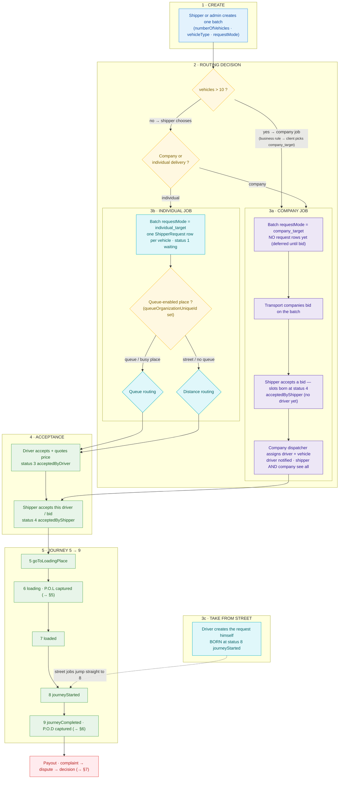
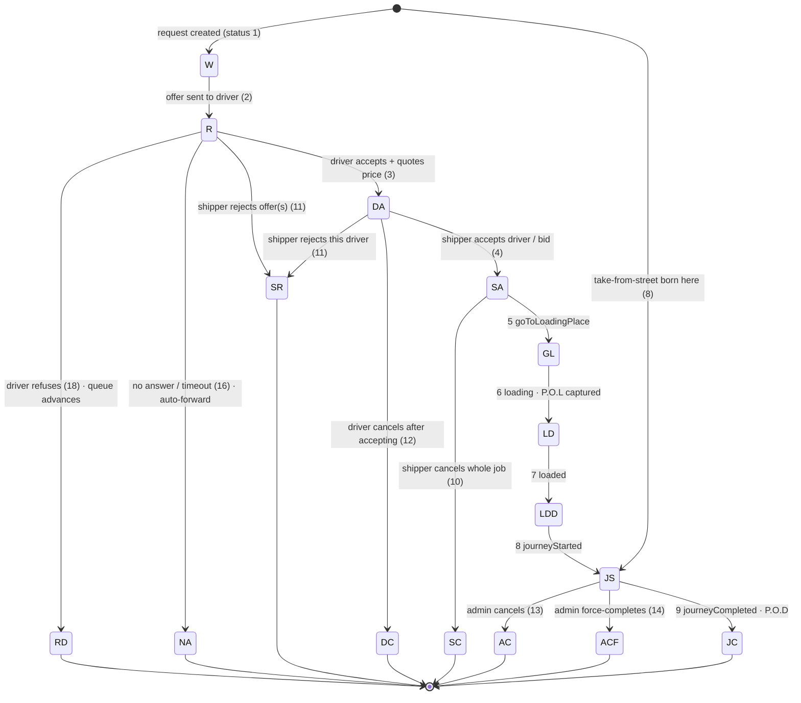
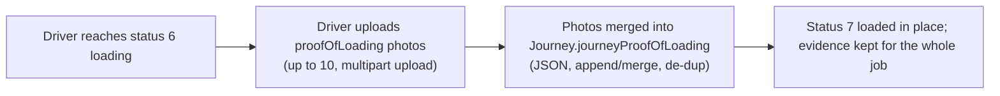
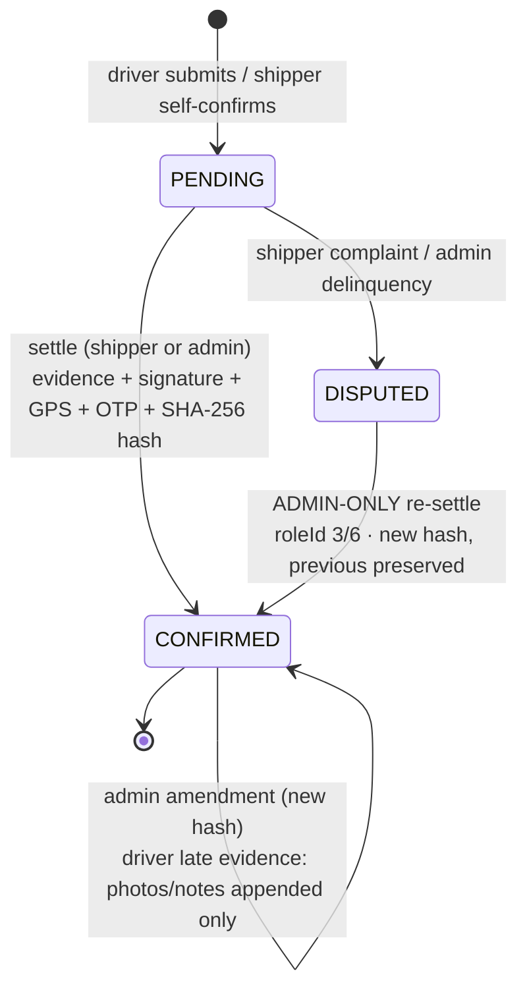
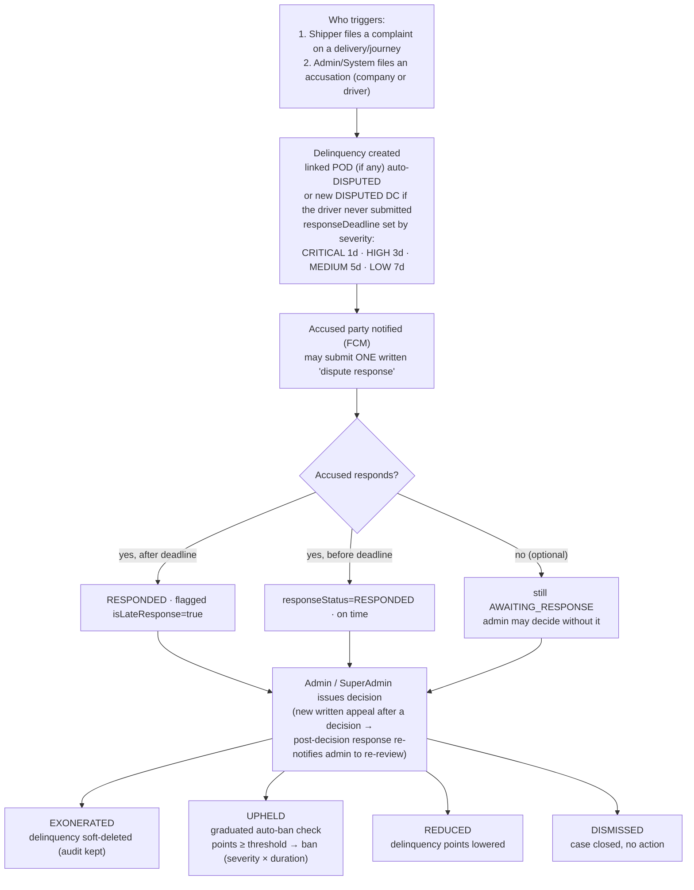
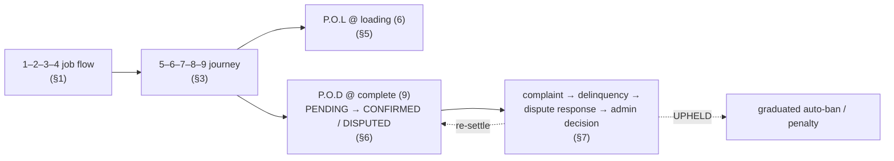

# App Job Flow — Shipper Request → Journey → Delivery (± P.O.L / P.O.D / Dispute)

> Scope: the **job/order flow** only (routing, queue vs distance vs company, journey
> statuses, acceptance & cancellation, P.O.L, P.O.D, and the complaint → dispute →
> response → decision lifecycle).
> Grounded in `Services/ShipperRequest/create.service.js`, `Services/CompanyBid/*`,
> `Services/CompanyAssignment/*`, `Services/DriverQueue.service.js`,
> `Services/Journey/*`, `Services/DeliveryConfirmation.service.js`,
> `Services/UserDelinquency|CompanyDelinquency/*`, `docs/DelinquencyLifecycle.js`.

---

## 1. Job flow overview

> **Reading the lanes**: §1 numbering is in the subgraph headers. Every path converges on
> driver-shipper acceptance **except** company jobs (slots are born at 4 because the shipper
> already accepted the *bid*) and street jobs (born at 8, already in transit).

> **Note on the >10 rule:** the "10+ vehicles → company" split is a **business rule on
> the client side**. In the backend the routing is driven by `requestMode`
> (`company_target` vs `individual_target`) plus optional `targetCompanyUniqueId`
> / `queueOrganizationUniqueId`; there is no hard-coded `10` in the server.

---

## 2. Entry points & routing decisions

| Scenario | requestMode | Who creates rows | Initial status | Routing |
|---|---|---|---|---|
| Shipper self-creates | `individual_target` | 1 row per vehicle | 1 `waiting` | queue (if `queueOrganizationUniqueId`) else distance |
| Admin creates for shipper | `individual_target` or `company_target` | same as shipper | 1 `waiting` | same as above |
| Company job | `company_target` | rows deferred → created on bid accept (born at 4) | 4 `acceptedByShipper` | company bids → company assigns drivers |
| Take from street | — (driver creates) | 1 row (driver) | 8 `journeyStarted` | none (already in transit) |

- **Queue routing:** order offered to the front waiting driver of its `vehicleTypeUniqueId`;
  this shipper's **reserved** drivers are offered before general drivers; drivers reserved
  for a *different* shipper are never eligible (see `Services/DriverQueue.service.js`
  `offerToDriver`).
- **Distance routing:** nearest available drivers within radius get a `JourneyDecision`
  with `decisionBy: "shipper"`.

---

## 3. Journey status 1 → 9 (`journeyStatusMap`, `Utils/ListOfSeedData.js`)

| # | Status | When |
|---|--------|------|
| 1 | `waiting` | request created, no driver yet (shipper/admin entry) |
| 2 | `requested` | offer sent to a driver (queue front or distance match) |
| 3 | `acceptedByDriver` | driver accepted + quoted price |
| 4 | `acceptedByShipper` | shipper picked this driver / accepted the company bid |
| 5 | `goToLoadingPlace` | driver on the way to load |
| 6 | `loading` | loading in progress (**P.O.L captured here**) |
| 7 | `loaded` | goods loaded |
| 8 | `journeyStarted` | in transit (also **take-from-street** starts here) |
| 9 | `journeyCompleted` | delivered (**P.O.D against this**); auto-POD source if `isPodRequired=false` |

Active statuses (not yet terminal): 1–8. Any status after acceptance (3) knows the driver;
**acceptance happens twice** — driver accepts an offer (→3), then shipper accepts the
driver or bid (→4). Company-bid slots are born at 4 and get a driver only when the
company assigns one.

---

## 4. Acceptance & cancellation — who can do what

| Actor | Action | Result |
|---|---|---|
| Driver | accepts an offer / quotes price | `3 acceptedByDriver` |
| Shipper | accepts a driver or a company bid | `4 acceptedByShipper` |
| Company | assigns a driver to an accepted slot | slot moves 4 → 5 → … (driver notified) |
| Driver | rejects offer **before** accepting | `18 rejectedByDriver` (queue: refusal penalty + order advances) |
| Driver | cancels **after** accepting | `12 cancelledByDriver` (queue: entry closed, refusal point, order advances) |
| Shipper | rejects the driver's price/offer | `11 rejectedByShipper` (queue: order advances to next driver) |
| Shipper | cancels the whole job | `10 cancelledByShipper` (partial → `20 partiallyCancelled`) |
| Company | cancels a bid (esp. after shipper accepted) | bid `cancelled_by_company` → slots back to `1 waiting`; commission-evasion check auto-fires |
| Admin / SuperAdmin | cancels, force-completes | `13 cancelledByAdmin` / `14 completedByAdmin` |
| System | timeout / no answer / auto-cancel | `16 noAnswerFromDriver` (auto-advance), `15 cancelledBySystem` |
| QueueOrgAdmin | manual dispatch, remove/reorder entry, cancel an offered order | queue-entry ops; order re-offered / advances |

### 4.1 Acceptance & cancellation map

> Statuses that end at `[*]` are terminal. Every cancel passes
> `assertIndividualCancellationReason` and records **who + why**. **Company** and
> **QueueOrgAdmin** act on objects the status map doesn't see directly — company wins a
> bid (slots), queue admin dispatches/removes queue entries — but each trigger ends here:
> company cancelling a won bid (esp. after shipper accepted) → commission-evasion check;
> queue admin removals/reorders are audit-logged and orders re-offer/advance per §4.

---

## 5. P.O.L — Proof of Loading

- Upload field: `proofOfLoading` (file array), captured in the driver-request/journey
  update flow (`Services/DriverRequest/journeyManagement.service.js` →
  `mergeProofOfLoading`, `Driver.controller.js:262`).
- P.O.L is **evidence captured at loading**; it has no standalone dispute state machine.
  A loading dispute (quantity/condition at load) is pursued through the same complaint →
  dispute → admin-decision lifecycle as P.O.D (§7), and the P.O.L photos are evidence in
  that case.

---

## 6. P.O.D — Proof of Delivery (`Services/DeliveryConfirmation.service.js`)

### 6.1 State machine

- **One record per journey** (`UNIQUE journeyUniqueId`); created via
  `POST /api/deliveryConfirmations` (photo required at create).
- **Sources** (`deliveryConfirmationSource`): `FORMAL_POD` (driver upload), `RECEIPT_AUTO`
  (receipt photos), `SHIPPER_DIRECT` (shipper self-declares), `AUTO_NO_POD`
  (auto-confirmed when `isPodRequired=false`), `DELINQUENCY_DISPUTE` (created DISPUTED from
  a complaint when the driver never submitted).
- **Settle (`PENDING → CONFIRMED`):** delivered quantity, condition
  (`GOOD|DAMAGED|PARTIAL`), receiver signature, GPS, notes; OTP verification
  (`request-sign-otp` → bcrypt check, attempt cap, expiry 410); a **tamper-evident
  SHA-256 hash** is written once.
- **Immutability:** signed fields (quantity, condition, signature, statement, GPS) are
  never overwritten. Driver **late evidence** on an already-CONFIRMED record appends
  photos/notes only. Any amendment creates a new hash while the previous hash is kept.
  Admins can verify integrity via `GET /:id/verify-hash`.
- **Dispute (`PENDING → DISPUTED`):** triggered automatically when a shipper complaint /
  delinquency targets the journey (below).

---

## 7. Complaint → Dispute → Response → Decision

The generic delinquency lifecycle (identical for drivers/users and companies;
`docs/DelinquencyLifecycle.js`, `UserDelinquency/create.service.js`).

| Step | Who | Deadline | Side effects |
|---|---|---|---|
| 1·Delinquency created | Shipper / Admin / System | `responseDeadline` 1–7 days by severity | linked POD → `DISPUTED`; accused notified; **no auto-ban at creation** |
| 2·Check pending | accused party | — | sees `responseDeadline`, `isOverdue`, `responseStatus` |
| 3·Dispute response | accused driver / company (one per delinquency, optional) | before deadline or flagged `LATE`; allowed **post-decision** too | post-decision → admin pushed to re-review |
| 4·Admin decision | Admin / SuperAdmin | waits for deadline (not enforced) | `EXONERATED`/`UPHELD`/`REDUCED`/`DISMISSED` |
| 5·Auto side-effects | System | — | UPHELD → graduated auto-ban check; REDUCED → lower points |

**P.O.D tie-in:** disputing a delinquency auto-flips the linked DeliveryConfirmation to
`DISPUTED`; only an admin (roleId 3/6) can re-settle it back to `CONFIRMED` (new hash,
previous hash preserved) — the shipper sees the dispute on the POD record.

---

## 8. End-to-end picture (job flow → journey → delivery → dispute)

