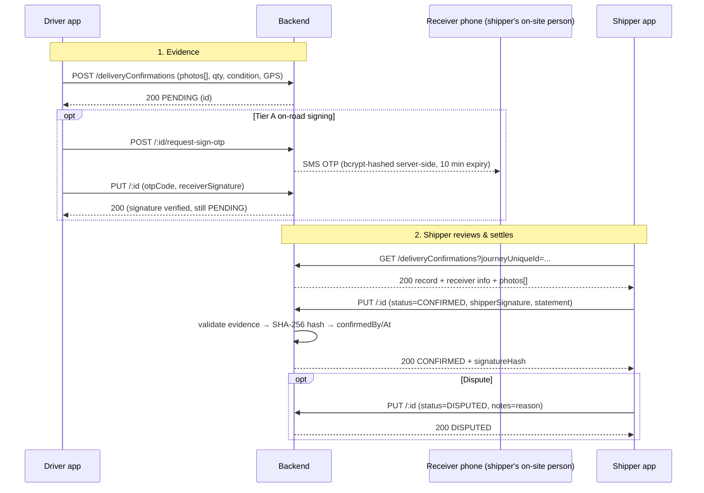

# Proof of Delivery (POD) — Design & Implementation Doc

> **Status:** Backend Phase 1 implemented · design doc complete (decisions, security, metrics, ops, ADR) · mobile apps implemented (driver capture flow + shipper review & settle)
> **Scope:** `transportBackEndNative` (backend) · `Driver_load_now/DriverLoadNow` (driver app) · `shipper` (shipper app)
> **Last updated:** 2026-08-15

## Implementation status

| Area | State |
|---|---|
| Multi-photo (`DeliveryConfirmationPhotos` + `photos[]` upload, append-only, `resolveDocumentUrl`) | ✅ implemented |
| `quantityUnit` Joi enum (`quintal|kg|piece`) | ✅ implemented |
| 12-column migration (two signatures + timestamps, statement, hash + previous-hash, OTP incl. hourly-cap window) | ✅ implemented (CREATE TABLE + idempotent `ensureDeliveryConfirmationColumns` in `Services/Database/tableManage.service.js`) |
| Settle-time evidence validation (signature + ≥1 photo + GPS + completed journey) | ✅ implemented |
| Immutable SHA-256 signature hash (photo-order independent) | ✅ implemented |
| Signed-field immutability + admin re-settle (`DISPUTED → CONFIRMED`) | ✅ implemented (roleId ∈ {3, 6}) |
| Tier-A OTP: `POST /:id/request-sign-otp` + bcrypt verify (expiry 410, attempt cap, resend block) | ✅ implemented |
| Unit tests (`__tests__/deliveryConfirmation.test.js`, 36 tests) | ✅ implemented |
| Driver app capture flow / shipper app review & settle | ✅ implemented (driver: `DriverLoadNow` `ProofOfDelivery` wizard; shipper: `shipper` `ProofOfDelivery` review) |
| Push notification on POD submit (`notifyShipperOfPodSubmit`, FCM) | ✅ implemented |
| Admin hash-verification tool (`GET /:id/verify-hash`, admin-only) | ✅ implemented |
| GET exposes the new evidence fields (signature, statement, hash, signed-at) | ✅ implemented |
| Hardening: delete guard, create-time `receiverSignedAt`, per-phone OTP cap | ✅ implemented |
| Admin dashboard UI + POD PDF export · legacy-hash backfill script · live smoke test | ⏳ Phase 4 / pending DB access |
| Doc: decisions log (§11), security & data (§12), metrics/SLOs (§13), migration/rollback (§14), alternatives ADR (§15) | ✅ added |

---

## 1. Purpose & Goals

POD is one of our **credibility measurements**: a tamper-evident, receiver-acknowledged
record that goods arrived, in what quantity, and in what condition — signed by the
receiving party, stamped with GPS and time, and protected against later alteration.

### Goals

1. **Prove delivery happened** — photo + GPS + timestamp + journey reference.
2. **Prove the receiver accepted it** — a real signature from the receiving party,
   not a name typed by the driver.
3. **Protect the driver** — the receiver signs a declaration of *condition at delivery*,
   so a later "it arrived damaged" claim shifts the burden of proof.
4. **Support disputes** — a PENDING → CONFIRMED/DISPUTED lifecycle with an audit trail
   (who created, who settled, when, and a tamper hash).
5. **One record per journey** — no duplicates, no ambiguity about which journey a POD
   belongs to.

---

## 2. Current Backend State (already built)

### 2.1 Table — `DeliveryConfirmations` (`Database/Database.js`)

```sql
deliveryConfirmationId                       -- PK auto-increment
deliveryConfirmationUniqueId VARCHAR(36)     -- UUID
journeyUniqueId VARCHAR(36)                  -- FK → Journey  (UNIQUE — one per journey)
receiverUserUniqueId VARCHAR(36)             -- FK → Users (who received the goods)
confirmedByUserUniqueId VARCHAR(36)          -- FK → Users (who settled it; NULL while PENDING)
deliveryConfirmationStatus ENUM('PENDING','CONFIRMED','DISPUTED') DEFAULT 'PENDING'
deliveryConfirmationDeliveredQuantity DECIMAL(14,3)
deliveryConfirmationQuantityUnit VARCHAR(30) -- 'quintal' | 'kg' | 'piece'
deliveryConfirmationCondition ENUM('GOOD','DAMAGED','PARTIAL') DEFAULT 'GOOD'
deliveryConfirmationReceiverSignature TEXT   -- Tier A receiver signature (SVG stroke markup; currently optional)
deliveryConfirmationPhotoUrl VARCHAR(500)    -- primary/cover photo (relative /uploads/...; full set in child table)
deliveryConfirmationNotes TEXT
deliveryConfirmationLatitude DECIMAL(10,8)
deliveryConfirmationLongitude DECIMAL(11,8)
deliveryConfirmationSubmittedAt DATETIME
deliveryConfirmationConfirmedAt DATETIME
deliveryConfirmationCreatedBy / UpdatedBy / DeletedBy VARCHAR(36)
deliveryConfirmationCreatedAt / UpdatedAt / DeletedAt DATETIME
-- UNIQUE KEY uqDeliveryConfirmationJourney (journeyUniqueId)
```

**Child table — `DeliveryConfirmationPhotos`** (full evidence photo set; append-only,
soft-deletable — photos are evidence, not replaceable):

```sql
deliveryConfirmationPhotoId INT AUTO_INCREMENT         -- PK
deliveryConfirmationPhotoUniqueId VARCHAR(36)          -- UUID
deliveryConfirmationUniqueId VARCHAR(36)               -- FK → DeliveryConfirmations
deliveryConfirmationPhotoUrl VARCHAR(500)              -- relative /uploads/... path
deliveryConfirmationPhotoCreatedAt DATETIME
deliveryConfirmationPhotoDeletedBy / DeletedAt
-- INDEX idx_dcPhoto_confirmation (deliveryConfirmationUniqueId)
```

The parent's `deliveryConfirmationPhotoUrl` stores the **first photo** (primary/cover)
for backward compatibility; the full set lives in the child table.

Lifecycle: **PENDING** (receiver/driver submitted) → **CONFIRMED** (accepted) | **DISPUTED**.

### 2.2 Routes — `Routes/DeliveryConfirmation.routes.js`

Mounted at **`/api/deliveryConfirmations`** in `Routes/index.js`. All protected by
`verifyTokenOfAxios`. Photo field name is **`photos`** (array, up to 10 files; the
legacy single **`photo`** field is still accepted and becomes the primary). Multer
memory storage, 10 MB max per file, jpeg/png/pdf/svg.

| Method | Path | Body / Params | Notes |
|---|---|---|---|
| POST | `/api/deliveryConfirmations` | multipart: `photos[]` + fields | Create (starts PENDING). `409` if journey already has one. |
| GET | `/api/deliveryConfirmations` | query: `journeyUniqueId`, `deliveryConfirmationUniqueId`, `receiverUserUniqueId`, `status`, `page`, `limit` | Filter + paginate |
| PUT | `/api/deliveryConfirmations/:deliveryConfirmationUniqueId` | multipart: optional `photos[]` + fields | Partial update (photo appends); settling sets `confirmedBy` + `confirmedAt` |
| DELETE | `/api/deliveryConfirmations/:deliveryConfirmationUniqueId` | — | Soft delete |

### 2.3 Validation — `Validations/DeliveryConfirmation.schema.js`

- **Create:** `journeyUniqueId` required; **exactly one** of `receiverUserUniqueId` **or**
  `receiverPhoneNumber` (`.oxor`); if phone is given, `receiverFullName` required (`.and`);
  `condition` defaults `GOOD`; optional `deliveredQuantity`, `receiverSignature`, `notes`,
  `latitude`, `longitude`.
- **`quantityUnit` enum (fixed):** must be one of `quintal | kg | piece` (Joi `.valid()`
  → clean `400`, not a MySQL data-truncation error).
- **Update:** `status` ∈ {PENDING, CONFIRMED, DISPUTED}; `condition` ∈ {GOOD, DAMAGED, PARTIAL}.
- `receiverSignature` is **currently optional everywhere** — this doc tightens that (see §4).

### 2.4 Service — `Services/DeliveryConfirmation.service.js`

- **create** — verifies journey exists; resolves receiver (reuse existing `userUniqueId`
  OR **find-or-create by phone** — take-from-street identity convention: shipper role,
  ACTIVE, placeholder email); inserts PENDING row + one row per photo in
  `DeliveryConfirmationPhotos`; parent `photoUrl` = first photo; `ER_DUP_ENTRY` → 409.
- **get** — filters + LEFT JOIN `Users r` (receiver) and `Users c` (confirmedBy);
  returns `receiverFullName`, `receiverPhoneNumber`, `confirmedByFullName`, and attaches
  `deliveryConfirmationPhotos[]` (second query). Stored relative paths are resolved to
  public URLs via `resolveDocumentUrl` (same convention as AttachedDocuments).
- **update** — partial SET; validates status/condition; new photo uploads are
  **append-only** (`INSERT` into `DeliveryConfirmationPhotos`; primary never overwritten
  via `COALESCE`); on `CONFIRMED`/`DISPUTED` sets `confirmedByUserUniqueId = updatedBy`
  and `deliveryConfirmationConfirmedAt`.
- **delete** — soft delete.

### 2.5 Apps — current state

Both apps now implement the POD flow end-to-end against the API contract in §5:

- **Driver app (`Driver_load_now/DriverLoadNow`):** `ProofOfDelivery` wizard
  (`src/screens/ProofOfDelivery/`) — Receiver → Goods → photo evidence (POST create,
  409 → GET + PUT fallback) → Tier A OTP + receiver signature (PUT) → done screen.
  Re-entry reads the existing record: PENDING skips straight to signing, while
  CONFIRMED/DISPUTED shows a read-only status. Wired via the 3 apiSlice mutations
  (`createDeliveryConfirmation`, `updateDeliveryConfirmation`,
  `requestDeliverySignOtp`) in `src/services/api/apiSlice.js` + `src/constants/api.js`;
  entered from a "Proof of delivery" button in `JourneySummary` → `CustomScreenManager`.
- **Shipper app (`shipper`):** `ProofOfDelivery` review screen
  (`src/screens/ProofOfDelivery/`) — evidence preview + the shared `SignaturePad`,
  Confirm (CONFIRMED + shipper signature) / Dispute (DISPUTED + reason), and read-only
  CONFIRMED/DISPUTED states (confirmed-by/at + tamper hash). API calls go through the
  `handleRequestToServer` util; entered from a "Proof of delivery" button in
  `src/Components/PaymentSummary/` → route in `AppNavigator`.

Shared pieces used by both: the `react-native-svg` signature pad (no webview), the
`getUniqueIds` util to derive `journeyUniqueId`, the established multipart upload
pattern, and the existing phone-OTP login gateway (reused for Tier A signing).

---

## 3. Signing & Enforcement Design

A driver-typed name is **not** a signature. Enforcement is three layers:

### Layer 1 — Prove *who* signed

**Tier A — On-road signing (receiver signs the driver's device).**
Backend sends a time-limited OTP (5–10 min) to the receiver's phone number via the
existing SMS/OTP gateway. The signature pad unlocks only after the OTP is verified.
The record stores the verified OTP (hashed), the resolved `receiverUserUniqueId`, GPS,
and timestamp. Works even when the shipper never opens their app.

**Tier B — In-app signing (shipper signs in the shipper app).**
The signature is captured under the shipper's authenticated session — their account,
their device, their timestamp. The driver physically cannot forge it.

> **Recommended:** **Tier B as the credibility record** (driver submits evidence →
> PENDING → shipper reviews & signs → CONFIRMED), **with Tier A as the on-road
> fallback** so the process isn't blocked waiting for the shipper to open the app.

### Layer 2 — Bind the signature to a *declaration*

The receiver signs a human-readable statement, not a blank canvas. The statement
embeds the delivery facts at signing time:

> **Declaration text** *(shown above the pad, before signing)*
> "I, **[receiver full name]**, confirm I received **[deliveredQuantity] [quantityUnit]**
> of goods for journey **[journey ref]** at **[place]** on **[date/time]**. I confirm the
> goods and container were delivered in **[GOOD / DAMAGED / PARTIAL]** condition and I
> have no damage claim against the driver for this delivery."

This is the **anti-negligence mechanism**: once the receiver signs "GOOD", a later
damage claim is a dispute against a signed, GPS-tagged acceptance — the burden of proof
shifts to the claimant.

### Layer 3 — Tamper-evidence

- **Immutable snapshot (decision, fixes the earlier contradiction):**
  `deliveryConfirmationSignatureHash` is computed **once, server-side, at final settle
  (CONFIRMED)** and **never recomputed in place** for ordinary flows. Tamper detection =
  stored hash ≠ recomputed hash over the stored fields. Signed fields (quantity,
  condition, signatures, photo set, GPS) are **immutable after settle** — normal updates
  to them are rejected (`400`). The only path to change them is an **admin amendment**, which
  stores a **new** hash and moves the previous hash to `deliveryConfirmationPreviousHash`
  (amendment, not overwrite; the original stays on record).

  **Hash input (canonical string, `|`-separated):**
  `journeyUniqueId | receiverSignature | shipperSignature | photoUrls (ordered) |
  deliveredQuantity | quantityUnit | condition | latitude | longitude | confirmedAt`
  — SHA-256 hex of this exact string is what the admin verification tool recomputes.
- **Two signatures, two columns (fixes the overwrite bug):** Tier A receiver signature
  and Tier B shipper signature each have their own column + timestamp (§4.1). The
  shipper's settle-time signature **never overwrites** the on-road receiver signature.
- Signatures stored as **SVG stroke markup** (vector, TEXT columns) — rendered via
  `react-native-svg` in both apps and `data:image/svg+xml` in web/admin; no PNG
  rasterization dependency needed in the apps (base64 PNG also fits the column if a
  raster is ever required).
- Audit trail already present: `createdBy`, `confirmedByUserUniqueId`,
  `deliveryConfirmationConfirmedAt`, `updatedBy`/`UpdatedAt`, soft-delete columns.

---

## 4. Proposed Backend Changes

### 4.1 Schema additions (`Database/Database.js`)

```sql
ALTER TABLE DeliveryConfirmations
  ADD COLUMN deliveryConfirmationSignatureHash VARCHAR(64) NULL,    -- SHA-256, computed ONCE at settle, never recomputed in place
  ADD COLUMN deliveryConfirmationPreviousHash VARCHAR(64) NULL,     -- prior hash, moved here on admin amendment (audit)
  ADD COLUMN deliveryConfirmationStatement TEXT NULL,               -- declaration text displayed at signing time
  ADD COLUMN deliveryConfirmationShipperSignature TEXT NULL,        -- Tier B: shipper's settle signature (separate column — never overwrites receiver's)
  ADD COLUMN deliveryConfirmationShipperSignedAt DATETIME NULL,     -- Tier B: = deliveryConfirmationConfirmedAt
  ADD COLUMN deliveryConfirmationReceiverSignedAt DATETIME NULL,    -- Tier A: when the on-road receiver signature was captured
  ADD COLUMN deliveryConfirmationOtpHash VARCHAR(100) NULL,         -- Tier A: bcrypt hash of the OTP (NOT plain SHA-256 — 6-digit codes are offline-brute-forceable)
  ADD COLUMN deliveryConfirmationOtpExpiresAt DATETIME NULL,        -- Tier A: short expiry (5–10 min)
  ADD COLUMN deliveryConfirmationOtpAttempts INT NOT NULL DEFAULT 0,-- Tier A: max 3–5 attempts, then invalidate
  ADD COLUMN deliveryConfirmationOtpVerifiedAt DATETIME NULL,       -- Tier A: set when OTP verified
  ADD COLUMN deliveryConfirmationOtpRequestCount INT NOT NULL DEFAULT 0, -- Tier A: requests in the current hourly window
  ADD COLUMN deliveryConfirmationOtpWindowStartAt DATETIME NULL;    -- Tier A: start of the hourly request window
```

*(12 columns total.)*

### 4.2 Enforcement rules (service layer)

| Rule | Where | Behavior |
|---|---|---|
| Settle requires evidence | `updateDeliveryConfirmation` when `status === 'CONFIRMED'` | Reject `BAD_REQUEST` unless signature present, **≥ 1 photo** (parent or `photos[]`), `latitude`, `longitude` |
| Signature hash at settle | same | Compute `SHA-256` **once** and store; **never recomputed in place** |
| Statement snapshot at settle | same | Store the declaration text that was displayed at signing time |
| Signed fields immutable post-settle | `updateDeliveryConfirmation` | Reject updates to quantity/condition/signatures/photos/GPS after `CONFIRMED` (`400` → actually `403`) unless caller is admin (roleId ∈ {3 admin, 6 super admin} from `req.user`) |
| Re-settle policy | `updateDeliveryConfirmation` | `CONFIRMED → anything` blocked; **`DISPUTED → CONFIRMED` allowed (admin only)** — stores a NEW hash, previous hash moved to `deliveryConfirmationPreviousHash` |
| Settle only on completed journey | `updateDeliveryConfirmation` | Reject settle (`CONFIRMED`) unless the journey is in a completed state |
| One per journey | create | Already enforced via `409` |
| `quantityUnit` domain | Joi schema | Must be one of `quintal|kg|piece` — clean `400`, not a MySQL truncation error |

### 4.3 New/changed endpoints

| Method | Path | Purpose |
|---|---|---|
| POST | `/api/deliveryConfirmations/:id/request-sign-otp` | **Tier A (implemented):** send OTP to the receiver's phone (resolved from `receiverUserUniqueId`). PENDING-only; resend blocked while a code is active (≈ 1 per 10 min TTL) to cap SMS volume |
| PUT | `/api/deliveryConfirmations/:id` | accepts `otpCode` (Tier A) + `receiverSignature` + `shipperSignature` + `statement` + optional `status`; verifies OTP (bcrypt compare + 5-attempt cap + expiry → 410) if provided |

Payloads are otherwise unchanged from §2.2.

---

## 5. API Contract (app-facing)

### 5.1 Driver app — submit evidence (create or update)

```
POST /api/deliveryConfirmations            (multipart/form-data)
  journeyUniqueId          required   uuid
  receiverPhoneNumber      required*  +251…            (*or receiverUserUniqueId)
  receiverFullName         required*  when phone given
  deliveredQuantity        optional   number
  quantityUnit             optional   'quintal' | 'kg' | 'piece'
  condition                optional   'GOOD' | 'DAMAGED' | 'PARTIAL'  (default GOOD)
  notes                    optional
  latitude / longitude     optional   GPS of the delivery point
  photos[]                 files      delivery proofs (field name: photos, ≤ 10;
                                      legacy single `photo` accepted as primary)

→ 200 { message, data: { deliveryConfirmationUniqueId, journeyUniqueId,
        deliveryConfirmationStatus: 'PENDING',
        deliveryConfirmationPhotoUrl (primary), deliveryConfirmationPhotos: [urls] } }
→ 409 CONFLICT — journey already has a confirmation → app falls back to GET + PUT
```

### 5.2 Driver app — on-road signature (Tier A, optional)

```
PUT /api/deliveryConfirmations/:id          (multipart/form-data)
  otpCode                required (Tier A)  6-digit code receiver received
  receiverSignature      required (Tier A)  receiver's SVG signature from the pad
                                             (stored in deliveryConfirmationReceiverSignature)
  status                 optional           leave PENDING (shipper settles later)

→ 200 { message, data: { ..., deliveryConfirmationStatus } }
→ 400 INVALID_OTP / 410 EXPIRED_OTP
```

### 5.3 Shipper app — fetch + settle

```
GET /api/deliveryConfirmations?journeyUniqueId=<uuid>
→ 200 { message, data: [ { ...full record, receiverFullName, receiverPhoneNumber,
        confirmedByFullName } ], pagination }

PUT /api/deliveryConfirmations/:id          (json)
  status                 'CONFIRMED' | 'DISPUTED'
  shipperSignature       required for CONFIRMED   (SVG signature from shipper's pad;
                                                   stored in deliveryConfirmationShipperSignature)
  notes                  optional (dispute reason)
→ 200 { message, data: { ..., deliveryConfirmationStatus: 'CONFIRMED',
        deliveryConfirmationSignatureHash, deliveryConfirmationConfirmedAt,
        deliveryConfirmationPhotos: [urls] } }
→ 400 — missing signature / ≥1 photo / GPS on settle
```

---

## 6. Driver App — Implementation & View

### 6.1 Wiring

1. **`src/constants/api.js`**
   ```js
   DELIVERY_CONFIRMATION: '/api/deliveryConfirmations',
   DELIVERY_CONFIRMATION_BY_ID: id => `/api/deliveryConfirmations/${id}`,
   DELIVERY_CONFIRMATION_BY_JOURNEY: journeyUniqueId =>
     `/api/deliveryConfirmations?journeyUniqueId=${journeyUniqueId}`,
   REQUEST_SIGN_OTP: id => `/api/deliveryConfirmations/${id}/request-sign-otp`,
   ```
2. **`src/services/api/apiSlice.js`** — three mutations following the `uploadDocument`
   FormData pattern (`formData: true`): `createDeliveryConfirmation`,
   `updateDeliveryConfirmation`, `requestDeliverySignOtp`; invalidate `['Journey']`.
3. **Entry point** — `src/components/Journey/JourneySummary/JourneySummary.js` renders a
   "Proof of delivery" button on the journeyCompleted panel that dispatches
   `setSelectedScreen('Proof of Delivery')`; `src/screens/CustomScreenManager/` renders
   the screen.
4. **New screen** `src/screens/ProofOfDelivery/` — steps below.
5. **New component** `src/components/Common/SignaturePad/SignaturePad.js` —
   `react-native-svg` `<Path>` + `PanResponder`; stores SVG stroke markup (vector, TEXT
   column) — no `react-native-view-shot` rasterization needed. (Identical component
   reused in the shipper app.)

### 6.2 Flow

```
journeyCompleted
   │
   ├─ GET confirmation by journeyUniqueId ── exists? ──► PENDING  → skip to Step 4 (sign)
   │                                                     CONFIRMED / DISPUTED → read-only status
   │
   └─ no → ProofOfDelivery wizard:
         Step 1  Receiver   → name + phone (prefill from shipper request; phone validated)
         Step 2  Goods      → delivered quantity + unit + condition (GOOD/DAMAGED/PARTIAL)
         Step 3  Evidence   → take/choose proof photos (up to 10)  (GPS auto-attached)
                              → Submit → POST create (or PUT if 409) → status PENDING
         Step 4  Sign       → [Tier A] "Send code" → OTP to the receiver's phone →
                              enter 6-digit code → declaration text → SignaturePad → Save
                              → PUT with otpCode + receiverSignature (status stays PENDING)
         Step 5  Done       → success screen showing the PENDING record
```

### 6.3 Driver View — wireframes

**Step 2 — Goods & Condition** *(inside the journeyCompleted bottom panel)*

```
┌────────────────────────────────────────────┐
│  ✓  Journey completed                      │
│  ┌──────────────────────────────────────┐  │
│  │  DELIVERY CONFIRMATION               │  │
│  │  Receiver:  Abebe Kebede             │  │
│  │  Phone:     +251 911 234 567         │  │
│  ├──────────────────────────────────────┤  │
│  │  Delivered quantity   [ 25 ] [quintal▾]│ │
│  │  Condition                            │  │
│  │    (●) GOOD   ( ) DAMAGED   ( ) PARTIAL│ │
│  │  Notes  [___________________________] │  │
│  ├──────────────────────────────────────┤  │
│  │  Proof photos (up to 10)             │  │
│  │   ┌─────┐ ┌─────┐ ┌─────┐ ┌─────┐   │  │
│  │   │ 📷  │ │ 📷  │ │ 📷  │ │ +Add│   │  │
│  │   │ 1/5 │ │ 2/5 │ │ 3/5 │ │     │   │  │
│  │   └─────┘ └─────┘ └─────┘ └─────┘   │  │
│  │  📍 GPS: 9.0108°N, 38.7612°E   ✓     │  │
│  ├──────────────────────────────────────┤  │
│  │  [  Next: Receiver signature  →  ]    │  │
│  └──────────────────────────────────────┘  │
└────────────────────────────────────────────┘
```

**Step 4 — Signature (Tier A: OTP-gated)**

```
┌────────────────────────────────────────────┐
│  DELIVERY CONFIRMATION — SIGN              │
│                                            │
│  📲 OTP sent to +251 911 234 567           │
│  Enter 6-digit code   [ _ _ _ _ _ _ ]      │
│  (valid 10 minutes)                        │
│  ────────────────────────────────────────  │
│  Declaration (read before signing):        │
│  ┌──────────────────────────────────────┐  │
│  │ "I, Abebe Kebede, confirm I received │  │
│  │  25 quintal for journey #J-8841 at   │  │
│  │  Addis Ababa on 15 Aug 2026, 14:32.  │  │
│  │  Goods delivered in GOOD condition.  │  │
│  │  No damage claim against the driver."│  │
│  └──────────────────────────────────────┘  │
│  ┌──────────────────────────────────────┐  │
│  │                                      │  │
│  │          ✍️  sign here                │  │
│  │                                      │  │
│  ├──────────────────────────────────────┤  │
│  │      [ Clear ]        [ Save ]       │  │
│  └──────────────────────────────────────┘  │
│  [ Submit to shipper for confirmation ]    │
└────────────────────────────────────────────┘
```

**Step 5 — Submitted**

```
┌────────────────────────────────────────────┐
│  ✅  Delivery confirmation submitted       │
│  Status: PENDING — awaiting shipper sign   │
│  Confirmation ID: DC-7f3a…                 │
│  Receiver: Abebe Kebede                    │
│  Quantity: 25 quintal · Condition: GOOD    │
│  Signed: ✓   Photo: ✓   GPS: ✓            │
│  [ Done ]                                  │
└────────────────────────────────────────────┘
```

---

## 7. Shipper App — Implementation & View

### 7.1 Wiring

1. **`utils/handleRequestToServer/handleRequestToServer`** — the POD API is called through
   the same axios util used across the app (GET by `journeyUniqueId`, PUT
   confirm/dispute) — no separate Redux RTK Query endpoint.
2. **`src/Components/SignaturePad/SignaturePad.js`** — the same `react-native-svg` pad as
   the driver app.
3. **Entry point** — `src/Components/PaymentSummary/PaymentSummary.js` renders a
   "Proof of delivery" button on the completed journey that navigates to the POD screen.
4. **New screen** `src/screens/ProofOfDelivery/` — steps below; registered as a
   `'Proof of Delivery'` route in `src/Navigation/AppNavigator.js`. Reuses the same
   `SignaturePad` component as the driver app.

### 7.2 Flow

```
Completed journey / request
   │
   ├─ GET confirmation by journeyUniqueId
   │
   ├─ status = PENDING  → "Review & sign" card (evidence preview)
   │      └─ Review screen:
   │            photo + quantity + condition + GPS + notes  (read-only evidence)
   │            → declaration text → SignaturePad
   │            → [Confirm delivery]  (CONFIRMED)  |  [Dispute]  (DISPUTED + reason)
   │
   ├─ status = CONFIRMED → green "Delivered & signed" card (read-only, shows hash)
   │
   └─ status = DISPUTED  → amber card with dispute reason (read-only)
```

### 7.3 Shipper View — wireframes

**Completed journey — POD card (PENDING)**

```
┌────────────────────────────────────────────┐
│  📦 Journey #J-8841 — Delivered 14:32      │
│  ┌──────────────────────────────────────┐  │
│  │  PROOF OF DELIVERY     ● PENDING     │  │
│  │  ┌──────┐    Receiver: Abebe K.     │  │
│  │  │ 📷 5 │    Qty: 25 quintal         │  │
│  │  └──────┘    Condition: GOOD         │  │
│  │  📍 9.0108°N, 38.7612°E              │  │
│  │  Submitted 15 Aug 2026 · 14:32       │  │
│  │  Signed by driver device: ✓          │  │
│  ├──────────────────────────────────────┤  │
│  │  [  Review & sign  →  ]              │  │
│  └──────────────────────────────────────┘  │
└────────────────────────────────────────────┘
```

**Review & sign screen**

```
┌────────────────────────────────────────────┐
│  REVIEW DELIVERY EVIDENCE                  │
│  ┌──────────────────────────────────────┐  │
│  │   (photo gallery — swipe 1/5)       │  │
│  │   ● ● ○ ○ ○                          │  │
│  └──────────────────────────────────────┘  │
│  Receiver: Abebe Kebede  (+251 911…)      │
│  Quantity: 25 quintal · Condition: GOOD   │
│  GPS: 9.0108°N, 38.7612°E                 │
│  Notes: "Arrived on time"                 │
│  ────────────────────────────────────────  │
│  Declaration (sign below):                │
│  "I, Abebe Kebede, confirm I received     │
│   25 quintal for journey #J-8841 at       │
│   Addis Ababa on 15 Aug 2026, 14:32.      │
│   Goods delivered in GOOD condition.      │
│   No damage claim against the driver."    │
│  ┌──────────────────────────────────────┐  │
│  │            ✍️  sign here              │  │
│  ├──────────────────────────────────────┤  │
│  │    [ Clear ]          [ Save ]       │  │
│  └──────────────────────────────────────┘  │
│  [ ✓ Confirm delivery ]  [ ⚠ Dispute ]    │
└────────────────────────────────────────────┘
```

**Confirmed state (read-only)**

```
┌────────────────────────────────────────────┐
│  ✅ PROOF OF DELIVERY — CONFIRMED          │
│  Confirmed by: Abebe Kebede (shipper)      │
│  Confirmed at: 15 Aug 2026 · 14:40         │
│  Quantity: 25 quintal · Condition: GOOD    │
│  Receiver sig: [ 🖊 ]  Shipper sig: [ 🖊 ]  │
│  Tamper hash: 9f2c…a1e7  (SHA-256)         │
│  Photo + GPS + notes — view all            │
└────────────────────────────────────────────┘
```

---

## 8. Sequence — Happy Path & Dispute



---

## 9. Edge Cases & Error Handling

| Case | Behavior |
|---|---|
| Second POST for same journey | `409` → app fetches existing record and switches to PUT |
| No evidence at settle | `400` — CONFIRMED requires signature + photo + GPS |
| OTP wrong / expired | `400 INVALID_OTP` (attempt counter — after 3–5 failures the code is invalidated) / `410 EXPIRED_OTP` → re-request |
| OTP brute force | OTP stored as **bcrypt** hash (not plain SHA-256), short expiry, attempt cap, per-phone rate limit on `request-sign-otp` |
| Already CONFIRMED, another settle attempt | `400` (or admin-only override) |
| Receiver phone not on file | Backend find-or-creates receiver user (existing behavior) |
| Offline driver at delivery point | Queue the submission (driver already has retry infra `retryRequest.js`); resubmit on reconnect — record only counts once |
| Photo > 10 MB / wrong type | Multer rejects — `413` for size limit, `400` for file-filter (type) rejection; compress on-device before upload |
| Journey cancelled after POD submitted | Keep record (audit); settle blocked if journey not completed |
| Disputed → resolution | Admin settles via `DISPUTED → CONFIRMED` re-settle — stores a NEW hash as an amendment; the original hash is kept for audit (never recomputed in place) |
| Edit after CONFIRMED | Rejected (`400`) for signed fields (quantity/condition/signatures/photos/GPS); admin amendments add a new hash + audit row |

---

## 10. Implementation Checklist

### Phase 1 — Backend (enforcement) — ✅ DONE
- [x] Multi-photo: `DeliveryConfirmationPhotos` table + `photos[]` upload (routes/controller/service) + append-only + `resolveDocumentUrl` at read time
- [x] `quantityUnit` Joi enum (`quintal|kg|piece`)
- [x] Migration: 12 new columns (§4.1) — shipper signature + timestamps, statement, immutable hash + previous-hash, OTP (bcrypt + expiry + attempts)
- [x] Settle-time validation: signature + ≥1 photo + GPS required for CONFIRMED (+ journey completed)
- [x] Immutable SHA-256 signature hash at settle (never recomputed in place; photo-order independent)
- [x] Signed-field immutability + admin re-settle (`DISPUTED → CONFIRMED` only, previous hash preserved)
- [x] Tier A: `request-sign-otp` endpoint (PENDING-only, resend-blocked) + bcrypt OTP verify in PUT
- [x] Unit tests: 36 tests (settle evidence, hash stability + formula, immutability, admin re-settle, OTP expiry/brute-force/cap, photo append, 409)

### Phase 2 — Driver app (submit) — ✅ DONE (offline queue + e2e open)
- [x] `constants/api.js` + 3 apiSlice mutations (`createDeliveryConfirmation`, `updateDeliveryConfirmation`, `requestDeliverySignOtp`)
- [x] `SignaturePad` component (`src/components/Common/SignaturePad/`, `react-native-svg`)
- [x] `ProofOfDelivery` wizard screen (receiver → goods → photo → submit → sign → done)
- [x] Hook into `JourneySummary` → `CustomScreenManager` ('Proof of Delivery' screen)
- [ ] Offline queue (409 → GET + PUT fallback is implemented; offline queue still open)
- [ ] e2e (Maestro): complete journey → submit POD → status PENDING

### Phase 3 — Shipper app (review & settle) — ✅ DONE (e2e open)
- [x] POD fetch + settle via the `handleRequestToServer` util (GET by journey, PUT confirm/dispute)
- [x] Entry: "Proof of delivery" button on the completed journey (`PaymentSummary`)
- [x] `ProofOfDelivery` review screen (evidence + SignaturePad + Confirm/Dispute)
- [x] Read-only CONFIRMED/DISPUTED states (confirmed-by/at + tamper hash shown)
- [ ] e2e (Maestro): review → sign → confirm → CONFIRMED visible to driver

### Phase 4 — Cross-cutting
- [x] Push notification to shipper when POD submitted (backend `notifyShipperOfPodSubmit`, FCM)
- [x] Admin hash-verification endpoint (`GET /:id/verify-hash`, admin-only)
- [ ] Admin dashboard UI (POD records + verify-hash viewer + PDF export)
- [ ] Docs: update API docs + Postman collection

---

## 11. Decisions Log (ADR-style)

**Ownership:** backend owner **[TBD]**, driver-app owner **[TBD]**, shipper-app owner
**[TBD]**. **Reviewed by:** **[TBD]**. Status history is tracked in git — each decision
below is dated and either *decided*, *implemented*, or *deferred*.

| # | Question | Decision | Rationale | Status |
|---|---|---|---|---|
| D1 | Tier A (OTP on driver device) vs Tier B (shipper signs in-app) — which first? | **Both, Tier B first.** Driver submits evidence → PENDING; shipper reviews & signs → CONFIRMED. Tier A is the on-road fallback so the flow never blocks on the shipper opening the app. | Two signature columns (§4.1) mean neither order loses data; Tier B needs no SMS spend and is the strongest identity binding (authenticated session); Tier A covers the "shipper never opens the app" reality. | Decided (apps phase) |
| D2 | Multiple photos per POD? | **Yes** — `DeliveryConfirmationPhotos` child table, append-only, soft-deletable; parent keeps the first photo as primary/cover. | Container + goods + receiver photos are all evidence; append-only preserves the chain. | **Implemented** |
| D3 | PDF export of the POD record? | **Yes** — Phase 4 admin tooling exports a PDF (evidence photo set + both signatures + statement + GPS + timestamps + hash) as the printable legal record. | Signatures/statement are PNG/text and hashable; a PDF is what a court/insurance claim expects. | Decided (Phase 4) |
| D4 | Who closes a DISPUTED record? | **Admin only** (roleId ∈ {3, 6}). `DISPUTED → CONFIRMED` re-settle writes a new hash and preserves the previous one; if the dispute stands, the record stays `DISPUTED` as the permanent dispute record. A separate `RESOLVED` enum value is deliberately *not* added — keep the state machine small; revisit only if admin workflow demands it. | Re-settle is already admin-gated and hash-preserving in code (§4.2); disputes are rare and high-stakes, so they deserve human review. | **Implemented** (code) |
| D5 | OTP channel | **SMS via the existing `Utils/smsSender` gateway is the primary channel.** Volume is bounded by the active-code gate (one code per 10-min TTL). Telegram fallback (already used for driver OTP) is a later enhancement, not a launch requirement. | Tier-B-first keeps SMS volume near zero (OTP only fires when a driver chooses on-road signing); the gateway is already wired and tested. | Decided (implemented) |
| D6 | Declaration language | **Store the exact text rendered at signing time** (client sends `statement`; the server generates a default when absent — implemented). Amharic/English templates are a presentation concern — the snapshot column is language-agnostic, so localizing later needs no schema change. | The snapshot is what the signer saw; that's what a dispute must be judged against. | **Implemented** (snapshot) |
| D7 | Hash: immutable snapshot vs recompute-on-edit | **Immutable snapshot** — computed once at settle, never recomputed in place; admin amendments write a new hash and move the old one to `PreviousHash`. | Recomputed-on-edit destroys tamper detection (the original review finding this doc fixes). | **Implemented** |

---

## 12. Security & Data

### 12.1 OTP scheme (implemented)

- **Storage:** bcrypt hash (`deliveryConfirmationOtpHash VARCHAR(100)`), never plaintext,
  never plain SHA-256 — a 6-digit code (10⁶ space) is offline-brute-forceable in seconds
  with SHA-256; bcrypt raises that cost to ~years.
- **Lifetime:** 10-minute expiry → `410 GONE` on use after expiry.
- **Attempts:** hard cap of 5 failures, then the code is dead (`400`).
- **Volume:** one active code at a time (resend blocked until TTL elapses → `429`).
  Per-phone hourly cap needs a counter column — **deferred hardening** (§14.3).

### 12.2 Data inventory & handling

| Data | Where | Classification | Handling |
|---|---|---|---|
| Receiver full name / phone / email | `Users` | PII | Created via find-or-create (take-from-street convention); phone is the primary identity |
| Receiver + shipper signatures | `DeliveryConfirmations` (TEXT SVG markup) | PII (handwriting) | Stored in DB, served only via authenticated API — **never** written to the public `/uploads` static dir |
| Proof photos | `/uploads/delivery_*.jpg` + `DeliveryConfirmationPhotos` | Shipment evidence (may contain goods/faces) | Same storage/serving posture as `AttachedDocuments` (UUID filenames, no PII in names, `resolveDocumentUrl`); static serving of the uploads dir is a platform-wide consideration, not POD-specific — revisit with a signed-URL policy if required |
| GPS + timestamps | `DeliveryConfirmations` | Location data | Recorded only for confirmed settlements; retained with the record |
| Declaration text | `deliveryConfirmationStatement` | Contractual text | Exact snapshot of what the signer saw |
| OTP hash + audit | `DeliveryConfirmations` (bcrypt hash, attempts, verifiedAt) | Authentication artifact | Bcrypt only; attempts counter bounded |

### 12.3 Retention

- **Default: keep.** POD records are evidence — do not delete settled confirmations without
  an explicit policy. Soft-delete exists only for PENDING/DISPUTED cleanup and is
  admin-audited (`DeletedBy`/`DeletedAt`).
- **Proposed policy (needs owner sign-off):** retain `CONFIRMED` records for the longer of
  (a) the account lifecycle or (b) the local statutory limitation period for transport
  claims; archive photos to cold storage after 2 years; purge OTP hash/attempts after
  settlement (they served their purpose) — currently retained for audit.
- **No retention job exists yet** — flag for Phase 4 ops; default behaviour is safe (keep).

### 12.4 Access control

- All endpoints behind `verifyTokenOfAxios`; identity from the JWT (`req.user`).
- Create: any authenticated user. Settle: any authenticated user, but recorded as
  `confirmedByUserUniqueId` — the audit trail names the signer.
- **Post-settle signed-field edits: admin only** (roleId ∈ {3, 6}) — implemented.
- **Known gap (deferred hardening):** `deleteDeliveryConfirmation` does not yet block
  deletion of a `CONFIRMED` record — see §14.3.

### 12.5 Legal note (needs counsel review)

The signature is a **finger-drawn acceptance marker** bound to identity proof (OTP to the
receiver's phone, or the shipper's authenticated session) + GPS + timestamp + tamper hash
— not a certified qualified electronic signature under eIDAS-class frameworks. Its
practical strength is the **declaration**: signing "GOOD" at delivery shifts the burden of
proof in any later damage claim. **Recommendation:** have legal counsel review the
declaration text (§3 Layer 2) and the settle flow before POD is used as *sole* evidence
in disputes.

---

## 13. Metrics & SLOs

Targets to instrument (none measured yet — baseline after launch).

### 13.1 Business / credibility metrics

| Metric | Definition | Target |
|---|---|---|
| POD coverage | % completed journeys with a confirmation submitted | ≥ 95% |
| Settle rate | % confirmations settled (CONFIRMED) within 24 h of submission | ≥ 90% |
| Median submit latency | journey completed → POD submitted (driver app) | < 5 min |
| Dispute rate | % settled confirmations disputed | < 2% |
| Dispute close time | DISPUTED → admin resolution | < 3 business days |

### 13.2 Technical SLOs

| SLO | Target |
|---|---|
| POST create (multipart upload) p95 | < 2 s |
| GET / settle p95 | < 500 ms |
| Photo upload success rate | ≥ 99.5% |
| OTP SMS delivery success | ≥ 98% (gateway-dependent) |
| API availability (create/settle) | ≥ 99.5% (aligned with platform) |

### 13.3 Capacity inputs to track

- Photos/month × avg size (1–2 MB) → storage growth; alert at 70% of the uploads volume
  budget.
- OTP volume/month (bounded by the active-code gate; near-zero with Tier-B-first).
- Instrumentation: request logging already exists (`RequestLogger`); add counters for
  submit / settle / dispute / 409 events via the existing GET aggregation endpoint.

---

## 14. Migration, Rollback & Backward Compatibility

### 14.1 Ship mechanism (implemented)

- The 12 new columns live in the `CREATE TABLE` (fresh DBs) **and** in an idempotent
  `ensureDeliveryConfirmationColumns()` migration that checks `information_schema` and
  ALTERs only missing columns — runs automatically inside the existing `createTable()`
  path used on deploy (same pattern as the queue-org migration). No manual DDL steps.
- `ADD COLUMN` at table end is an instant DDL in MySQL 8 / InnoDB → **no downtime**.

### 14.2 Rollback

- **Code rollback:** reverting the deploy leaves the new columns unused; all new request
  fields are optional, so old code keeps working unchanged.
- **DB rollback:** the columns are all nullable and brand-new — they can be left in place
  harmlessly, or dropped (`DROP COLUMN`) with zero data loss.
- **Old app versions:** fully backward compatible — legacy single `photo` field still
  accepted by the multipart route; updates without `status`/signature behave as before;
  GET gains an *additive* `deliveryConfirmationPhotos[]` field.
- **Enforcement blast radius:** the new rules only fire on explicit `status=CONFIRMED`
  transitions — flows that never settle are unaffected. No feature flag needed.

### 14.3 Hardening status

Resolved (implemented + tested):

1. ✅ **Per-phone OTP hourly cap** (5/hour) — `deliveryConfirmationOtpRequestCount` +
   `deliveryConfirmationOtpWindowStartAt` columns; window resets after 60 min.
2. ✅ **Delete guard on settled records** — `DELETE` of `CONFIRMED` rows requires admin
   role (roleId ∈ {3, 6}); soft-delete still records who/when.
3. ✅ **`receiverSignedAt` at create-time** — stamped when a signature is sent with the
   create request.
4. ⏳ **Historical backfill** — any pre-existing `CONFIRMED` rows have `NULL` hash; the
   `verify-hash` endpoint treats them as `legacy: true`. A deterministic backfill job can
   recompute hashes — optional Phase 4 script.

### 14.4 Pre-launch smoke checklist

- [ ] Run `createTable()` against staging; confirm the 12 columns land idempotently on a
      pre-existing DB.
- [ ] POST create with `photos[]` (3 files) → 200 PENDING; GET returns the array with
      resolved URLs.
- [ ] `request-sign-otp` → SMS received; settle with wrong/expired/right OTP.
- [ ] Settle without signature/photo/GPS → 400; settle on non-completed journey → 400.
- [ ] Confirm hash matches the documented formula (§3); re-settle flow preserves
      `PreviousHash`; `GET /:id/verify-hash` returns `valid: true`.
- [ ] Confirm the shipper receives an FCM push on POD submit (when DeviceTokens exist).
- [ ] Old-client regression: POST with legacy single `photo` field still works.

---

## 15. Alternatives Considered (ADR)

### A — In-house signature pad (chosen)

`react-native-svg` `<Path>` + `PanResponder` → SVG stroke markup stored in the DB (base64
PNG also fits the column if a raster is ever needed). **Why chosen:** works fully offline at the delivery point (critical on
Ethiopian roads); zero recurring cost; deep integration with our auth/OTP/role stack;
full control over declaration + hash + audit; both apps already ship `react-native-svg`.
**Cost:** not a certified e-signature provider — the marker is only as trusted as the
identity-binding layer (OTP / shipper session).

### B — Third-party e-signature (DocuSign / SignEasy / Adobe Sign)

**Rejected for launch.** Requires connectivity at the exact delivery moment (the on-road
case is where our network is weakest); per-signature subscription; a separate identity
flow disconnected from our `Users` table; does not cover our photo/GPS/declaration/hash
requirements; heavy RN SDK. Would still need our evidence pipeline regardless.

### C — Hybrid (in-house now, certified export later)

**Accepted as an escape hatch.** The stored SVG signature + statement + hash is portable:
if legal review (§12.5) demands certified signatures for high-value disputes, export the
record to a provider without changing the capture flow.

### D — Typed name / QR acknowledgment

**Rejected.** A typed name carries no signature evidence; a QR scan proves a phone was
present, not consent — the OTP layer already covers presence, and the finger-drawn pad
adds the personal act of signing that the declaration needs.

**Decision:** A now, C as the documented fallback. Revisit only if counsel or a
high-value dispute demands certification.
