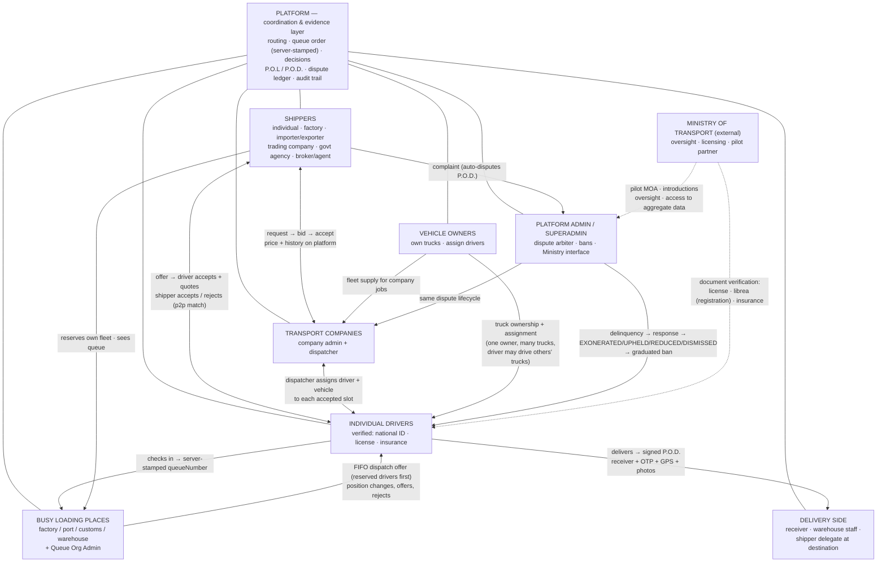

# Stakeholder Relationships — Who Talks to Whom

> The institutional view of the platform: actors, their relationships, and the
> platform as the coordination + evidence layer. Complements `docs/app-flow-job.md`
> (which shows the *job flow*; this shows the *relationships*).
> Roles from `Utils/ListOfSeedData.js`: shipper 1 · driver 2 · admin 3 · vehicle
> owner 4 · system 5 · superAdmin 6 · companyAdmin 7 · company(org) 8 ·
> vehicle(org) 9 · dispatcher 10 · queueOrgAdmin 11.

---

## 1. Stakeholder relationship map

---

## 2. What each stakeholder gets (and owes)

| Stakeholder | The platform gives them | What the system expects back |
|---|---|---|
| **Shipper** | verified driver pool, protected reserved fleet, live status, tamper-evident P.O.L/P.O.D., dispute record | truthful job specs, honoring accepted drivers/bids |
| **Individual driver** | visible position, no all-day blind waiting, fair FIFO + reservation priority, proof of delivery | ID/license/insurance verified, honor offers or take a refusal point |
| **Transport company (+dispatcher)** | company bidding, slot assignment from fleet, end-to-end visibility for large jobs | deliver what it bids; cancelling after acceptance triggers commission-evasion flag |
| **Vehicle owner** | register many trucks, assign different drivers, corporate fleet supply | valid vehicle docs (librea, insurance) |
| **Queue org / loading place + admin** | digital audited queue replacing paper, server-stamped "dispute truth", override audit log | impartial check-in/check-out and position rulings |
| **Receiver / delivery side** | their signature + OTP + GPS becomes legal-grade proof | confirm via the P.O.D. record |
| **Admin / SuperAdmin** | dispute arbitration with clear outcomes and auto-ban | fair decisions; the Ministry's technical counterpart |
| **Ministry** | oversight seat, data access, a controlled pilot on real corridors | introductions/MOA for Phase 1 — low risk for them |

---

## 3. The one-line institutional read

> The platform is a **trust layer** between shippers, drivers, transport companies,
> loading-place administrators, and delivery receivers — the Ministry's natural
> position is **strategic overseer of the pilot**, not operator of the app.